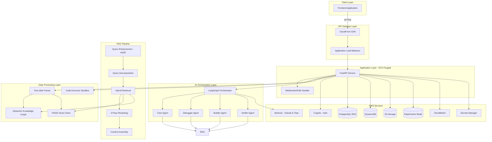

# Design Document: AstraMentor Backend System

## Overview

The AstraMentor backend is a sophisticated AI-powered tutoring system built on AWS infrastructure. The architecture follows a microservices-inspired approach with clear separation between the API layer, AI orchestration layer, data processing layer, and storage layer.

### Key Design Principles

1. **Cost-Consciousness**: Every architectural decision considers the $300 budget constraint
2. **Scalability**: Horizontal scaling through ECS Fargate with auto-scaling policies
3. **Modularity**: Clear separation of concerns between components
4. **Resilience**: Circuit breakers, retries, and graceful degradation
5. **Performance**: Aggressive caching and async processing where possible

### Technology Stack

- **API Framework**: FastAPI (Python) - async support, automatic OpenAPI docs, high performance
- **AI Orchestration**: LangGraph - agent workflow management with state persistence
- **AI Models**: AWS Bedrock (Claude 3.5 Sonnet, Claude 3 Haiku, Titan Embeddings)
- **Vector Search**: FAISS - local, zero-cost similarity search
- **Knowledge Graph**: NetworkX - in-memory graph operations with disk persistence
- **Code Parsing**: Tree-sitter - incremental parsing for 6 languages
- **Databases**: PostgreSQL (RDS), DynamoDB, Redis (ElastiCache)
- **Storage**: S3 for repositories and artifacts
- **Infrastructure**: AWS CDK for infrastructure-as-code
- **Container Orchestration**: ECS Fargate with Application Load Balancer


## Architecture

### High-Level Architecture



### Component Layers

#### 1. API Layer (FastAPI)
- **Responsibilities**: Request routing, authentication, validation, response formatting
- **Key Features**: 
  - Async request handling for high concurrency
  - Pydantic models for request/response validation
  - Automatic OpenAPI documentation generation
  - CORS middleware for frontend integration
  - Rate limiting middleware
  - Request ID tracking for distributed tracing

#### 2. AI Orchestration Layer (LangGraph)
- **Responsibilities**: Agent coordination, workflow management, state persistence
- **Key Features**:
  - State machine for agent transitions
  - Conversation memory management
  - Agent selection based on intent classification
  - Parallel agent execution when appropriate
  - Checkpointing for long-running workflows

#### 3. RAG Pipeline
- **Responsibilities**: Query processing, retrieval, context assembly
- **Key Features**:
  - Multi-stage processing for optimal retrieval
  - Hybrid search combining vector and graph
  - Intelligent reranking for relevance
  - Token budget management for context window

#### 4. Data Processing Layer
- **Responsibilities**: Code parsing, indexing, execution
- **Key Features**:
  - Incremental parsing and indexing
  - Multi-language support
  - Graph and vector index construction
  - Sandboxed code execution

#### 5. Storage Layer
- **Responsibilities**: Data persistence, caching, file storage
- **Key Features**:
  - PostgreSQL for relational data
  - DynamoDB for high-velocity data
  - Redis for caching and rate limiting
  - S3 for file storage


## Components and Interfaces

### 1. FastAPI Application

```python
# Main application structure
class AstraMentorAPI:
    def __init__(self):
        self.app = FastAPI(title="AstraMentor API", version="1.0.0")
        self.setup_middleware()
        self.setup_routes()
        self.setup_exception_handlers()
    
    def setup_middleware(self):
        # CORS, authentication, rate limiting, logging
        pass
    
    def setup_routes(self):
        # Register all route modules
        pass
```

**Key Endpoints**:
- `/api/v1/auth/*` - Authentication (Cognito integration)
- `/api/v1/repo/*` - Repository management
- `/api/v1/chat/*` - Chat and streaming
- `/api/v1/graph/*` - Knowledge graph queries
- `/api/v1/verify/*` - Code verification
- `/api/v1/sessions/*` - Session management
- `/api/v1/progress/*` - Learning progress
- `/api/v1/playground/*` - Code execution
- `/api/v1/challenges/*` - Challenge management
- `/api/v1/review/*` - Code review
- `/api/v1/snippets/*` - Snippet CRUD

### 2. LangGraph Agent Orchestrator

```python
from langgraph.graph import StateGraph, END

class AgentOrchestrator:
    def __init__(self, bedrock_client, memory_store):
        self.bedrock = bedrock_client
        self.memory = memory_store
        self.graph = self.build_graph()
    
    def build_graph(self) -> StateGraph:
        """Build the agent workflow graph"""
        graph = StateGraph(AgentState)
        
        # Add agent nodes
        graph.add_node("intent_classifier", self.classify_intent)
        graph.add_node("tutor", self.tutor_agent)
        graph.add_node("debugger", self.debugger_agent)
        graph.add_node("builder", self.builder_agent)
        graph.add_node("verifier", self.verifier_agent)
        graph.add_node("response_formatter", self.format_response)
        
        # Add edges with conditional routing
        graph.add_edge("intent_classifier", self.route_to_agent)
        graph.add_edge("tutor", "response_formatter")
        graph.add_edge("debugger", "response_formatter")
        graph.add_edge("builder", "response_formatter")
        graph.add_edge("verifier", "response_formatter")
        graph.add_edge("response_formatter", END)
        
        graph.set_entry_point("intent_classifier")
        return graph.compile()
    
    async def process_query(self, query: str, context: dict) -> dict:
        """Process a user query through the agent graph"""
        state = AgentState(
            query=query,
            context=context,
            conversation_history=self.memory.get_history(context["session_id"])
        )
        result = await self.graph.ainvoke(state)
        return result
```

**Agent State Schema**:
```python
class AgentState(TypedDict):
    query: str
    intent: str
    context: dict
    conversation_history: list
    retrieved_context: list
    agent_response: str
    metadata: dict
```

### 3. Specialized Agents

#### Tutor Agent
```python
class TutorAgent:
    """Socratic questioning and progressive hints"""
    
    def __init__(self, bedrock_client, irt_engine):
        self.bedrock = bedrock_client
        self.irt = irt_engine
    
    async def process(self, state: AgentState) -> str:
        """Generate Socratic response based on user skill level"""
        skill_level = self.irt.get_user_skill(state.context["user_id"])
        
        prompt = self.build_socratic_prompt(
            query=state.query,
            skill_level=skill_level,
            context=state.retrieved_context,
            history=state.conversation_history
        )
        
        response = await self.bedrock.invoke_claude_sonnet(
            prompt=prompt,
            stream=True
        )
        
        return response
    
    def build_socratic_prompt(self, query, skill_level, context, history):
        """Build prompt that encourages discovery learning"""
        return f"""You are a Socratic tutor. Guide the student to discover the answer.
        
Student skill level: {skill_level}/10
Question: {query}
Relevant code context: {context}
Conversation history: {history}

Provide a guiding question or hint that helps them think through the problem.
Do not give direct answers. Adjust difficulty based on skill level."""
```

#### Debugger Agent
```python
class DebuggerAgent:
    """Error analysis and root cause identification"""
    
    async def process(self, state: AgentState) -> str:
        """Analyze error and provide progressive hints"""
        error_info = self.extract_error_info(state.query)
        
        # Retrieve similar errors from knowledge base
        similar_errors = await self.retrieve_similar_errors(error_info)
        
        prompt = self.build_debug_prompt(
            error=error_info,
            code_context=state.retrieved_context,
            similar_errors=similar_errors
        )
        
        response = await self.bedrock.invoke_claude_sonnet(prompt)
        return response
```

#### Builder Agent
```python
class BuilderAgent:
    """Code generation and refactoring suggestions"""
    
    async def process(self, state: AgentState) -> str:
        """Generate code or refactoring suggestions"""
        prompt = self.build_generation_prompt(
            request=state.query,
            codebase_context=state.retrieved_context,
            style_guide=self.get_style_guide(state.context["repo_id"])
        )
        
        response = await self.bedrock.invoke_claude_sonnet(prompt)
        return response
```

#### Verifier Agent
```python
class VerifierAgent:
    """Test generation and code validation"""
    
    async def process(self, state: AgentState) -> str:
        """Generate tests and validate code quality"""
        code = self.extract_code(state.query)
        
        # Run static analysis
        analysis = await self.analyze_code(code)
        
        # Generate test cases
        tests = await self.generate_tests(code, state.retrieved_context)
        
        prompt = self.build_verification_prompt(
            code=code,
            analysis=analysis,
            tests=tests
        )
        
        response = await self.bedrock.invoke_claude_sonnet(prompt)
        return response
```

### 4. RAG Pipeline Implementation

```python
class RAGPipeline:
    def __init__(self, vector_store, knowledge_graph, bedrock_client):
        self.vector_store = vector_store
        self.kg = knowledge_graph
        self.bedrock = bedrock_client
    
    async def retrieve(self, query: str, repo_id: str, top_k: int = 20) -> list:
        """Execute 5-stage RAG pipeline"""
        
        # Stage 1: Query Enhancement (HyDE)
        enhanced_query = await self.enhance_query_hyde(query)
        
        # Stage 2: Query Decomposition
        sub_queries = self.decompose_query(enhanced_query)
        
        # Stage 3: Hybrid Retrieval
        vector_results = await self.vector_retrieve(sub_queries, repo_id, top_k)
        graph_results = await self.graph_retrieve(sub_queries, repo_id, top_k)
        combined_results = self.merge_results(vector_results, graph_results)
        
        # Stage 4: 3-Pass Reranking
        reranked = await self.three_pass_rerank(combined_results, query)
        
        # Stage 5: Context Assembly
        context = self.assemble_context(reranked, max_tokens=8000)
        
        return context
    
    async def enhance_query_hyde(self, query: str) -> str:
        """Generate hypothetical document for better retrieval"""
        prompt = f"""Generate a hypothetical code snippet or documentation 
that would answer this question: {query}"""
        
        hypothetical_doc = await self.bedrock.invoke_claude_haiku(prompt)
        return f"{query}\n\nHypothetical answer: {hypothetical_doc}"
    
    def decompose_query(self, query: str) -> list:
        """Break complex query into sub-queries"""
        # Use simple heuristics or LLM for decomposition
        if "and" in query.lower() or "also" in query.lower():
            # Split into multiple queries
            return self.split_query(query)
        return [query]
    
    async def vector_retrieve(self, queries: list, repo_id: str, top_k: int) -> list:
        """Retrieve using FAISS vector search"""
        all_results = []
        for query in queries:
            embedding = await self.bedrock.get_embedding(query)
            results = self.vector_store.search(
                embedding=embedding,
                repo_id=repo_id,
                top_k=top_k
            )
            all_results.extend(results)
        return all_results
    
    async def graph_retrieve(self, queries: list, repo_id: str, top_k: int) -> list:
        """Retrieve using knowledge graph traversal"""
        all_results = []
        for query in queries:
            # Extract entities from query
            entities = self.extract_entities(query)
            
            # Find related nodes in graph
            for entity in entities:
                related = self.kg.get_related_nodes(
                    entity=entity,
                    repo_id=repo_id,
                    max_depth=2
                )
                all_results.extend(related)
        return all_results
    
    async def three_pass_rerank(self, results: list, query: str) -> list:
        """Apply 3-pass reranking"""
        # Pass 1: Semantic similarity
        pass1 = self.rerank_semantic(results, query)
        
        # Pass 2: Code relevance
        pass2 = self.rerank_code_relevance(pass1, query)
        
        # Pass 3: Context window optimization
        pass3 = self.rerank_context_optimization(pass2)
        
        return pass3
    
    def rerank_semantic(self, results: list, query: str) -> list:
        """Rerank by semantic similarity score"""
        # Already have similarity scores from vector search
        return sorted(results, key=lambda x: x.get("score", 0), reverse=True)
    
    def rerank_code_relevance(self, results: list, query: str) -> list:
        """Rerank by code-specific relevance"""
        scored = []
        for result in results:
            score = 0
            # Boost if contains function definitions
            if "def " in result["content"] or "function " in result["content"]:
                score += 0.2
            # Boost if contains imports related to query
            if self.has_relevant_imports(result["content"], query):
                score += 0.1
            # Boost if entity type matches query intent
            if self.entity_type_matches(result.get("entity_type"), query):
                score += 0.15
            
            result["code_relevance_score"] = score
            scored.append(result)
        
        return sorted(scored, 
                     key=lambda x: x.get("score", 0) + x.get("code_relevance_score", 0),
                     reverse=True)
    
    def rerank_context_optimization(self, results: list) -> list:
        """Optimize for context window diversity"""
        # Ensure diversity of file sources
        # Penalize duplicate information
        seen_files = set()
        optimized = []
        
        for result in results:
            file_path = result.get("file_path")
            if file_path not in seen_files or len(seen_files) < 5:
                optimized.append(result)
                seen_files.add(file_path)
        
        return optimized
    
    def assemble_context(self, results: list, max_tokens: int) -> list:
        """Assemble final context within token budget"""
        context = []
        token_count = 0
        
        for result in results:
            result_tokens = self.estimate_tokens(result["content"])
            if token_count + result_tokens <= max_tokens:
                context.append(result)
                token_count += result_tokens
            else:
                break
        
        return context
    
    def estimate_tokens(self, text: str) -> int:
        """Estimate token count (rough approximation)"""
        return len(text) // 4  # Rough estimate: 1 token ≈ 4 characters
```

### 5. Knowledge Graph Manager

```python
import networkx as nx
import json

class KnowledgeGraphManager:
    def __init__(self, storage_path: str):
        self.storage_path = storage_path
        self.graphs = {}  # repo_id -> nx.DiGraph
    
    def load_graph(self, repo_id: str) -> nx.DiGraph:
        """Load graph from disk"""
        if repo_id in self.graphs:
            return self.graphs[repo_id]
        
        graph_file = f"{self.storage_path}/{repo_id}_graph.json"
        if os.path.exists(graph_file):
            with open(graph_file, 'r') as f:
                data = json.load(f)
                graph = nx.node_link_graph(data)
                self.graphs[repo_id] = graph
                return graph
        
        return nx.DiGraph()
    
    def save_graph(self, repo_id: str):
        """Persist graph to disk"""
        graph = self.graphs.get(repo_id)
        if graph:
            graph_file = f"{self.storage_path}/{repo_id}_graph.json"
            data = nx.node_link_data(graph)
            with open(graph_file, 'w') as f:
                json.dump(data, f)
    
    def add_node(self, repo_id: str, node_id: str, node_type: str, attributes: dict):
        """Add node to knowledge graph"""
        graph = self.load_graph(repo_id)
        graph.add_node(node_id, type=node_type, **attributes)
        self.graphs[repo_id] = graph
    
    def add_edge(self, repo_id: str, source: str, target: str, relationship: str):
        """Add edge to knowledge graph"""
        graph = self.load_graph(repo_id)
        graph.add_edge(source, target, relationship=relationship)
        self.graphs[repo_id] = graph
    
    def get_related_nodes(self, repo_id: str, entity: str, max_depth: int = 2) -> list:
        """Get nodes related to entity within max_depth"""
        graph = self.load_graph(repo_id)
        
        if entity not in graph:
            return []
        
        # BFS to find related nodes
        related = []
        visited = set()
        queue = [(entity, 0)]
        
        while queue:
            node, depth = queue.pop(0)
            if node in visited or depth > max_depth:
                continue
            
            visited.add(node)
            node_data = graph.nodes[node]
            related.append({
                "node_id": node,
                "type": node_data.get("type"),
                "attributes": node_data,
                "depth": depth
            })
            
            # Add neighbors to queue
            for neighbor in graph.neighbors(node):
                if neighbor not in visited:
                    queue.append((neighbor, depth + 1))
        
        return related
    
    def find_dependencies(self, repo_id: str, entity: str) -> list:
        """Find all dependencies of an entity"""
        graph = self.load_graph(repo_id)
        
        if entity not in graph:
            return []
        
        dependencies = []
        for successor in graph.successors(entity):
            edge_data = graph.edges[entity, successor]
            if edge_data.get("relationship") in ["imports", "depends_on", "calls"]:
                dependencies.append({
                    "entity": successor,
                    "relationship": edge_data.get("relationship"),
                    "attributes": graph.nodes[successor]
                })
        
        return dependencies
    
    def find_concept_clusters(self, repo_id: str) -> list:
        """Identify concept clusters using community detection"""
        graph = self.load_graph(repo_id)
        
        # Convert to undirected for community detection
        undirected = graph.to_undirected()
        
        # Use Louvain community detection
        import community as community_louvain
        communities = community_louvain.best_partition(undirected)
        
        # Group nodes by community
        clusters = {}
        for node, community_id in communities.items():
            if community_id not in clusters:
                clusters[community_id] = []
            clusters[community_id].append(node)
        
        return list(clusters.values())
```

### 6. Vector Store Manager

```python
import faiss
import numpy as np
import pickle

class VectorStoreManager:
    def __init__(self, storage_path: str, dimension: int = 1536):
        self.storage_path = storage_path
        self.dimension = dimension
        self.indices = {}  # repo_id -> faiss.Index
        self.metadata = {}  # repo_id -> list of metadata dicts
    
    def load_index(self, repo_id: str) -> faiss.Index:
        """Load FAISS index from disk"""
        if repo_id in self.indices:
            return self.indices[repo_id]
        
        index_file = f"{self.storage_path}/{repo_id}_index.faiss"
        metadata_file = f"{self.storage_path}/{repo_id}_metadata.pkl"
        
        if os.path.exists(index_file):
            index = faiss.read_index(index_file)
            with open(metadata_file, 'rb') as f:
                metadata = pickle.load(f)
            
            self.indices[repo_id] = index
            self.metadata[repo_id] = metadata
            return index
        
        # Create new HNSW index
        index = faiss.IndexHNSWFlat(self.dimension, 32)
        self.indices[repo_id] = index
        self.metadata[repo_id] = []
        return index
    
    def save_index(self, repo_id: str):
        """Persist index to disk"""
        index = self.indices.get(repo_id)
        metadata = self.metadata.get(repo_id)
        
        if index:
            index_file = f"{self.storage_path}/{repo_id}_index.faiss"
            metadata_file = f"{self.storage_path}/{repo_id}_metadata.pkl"
            
            faiss.write_index(index, index_file)
            with open(metadata_file, 'wb') as f:
                pickle.dump(metadata, f)
    
    def add_vectors(self, repo_id: str, embeddings: np.ndarray, metadata_list: list):
        """Add vectors to index"""
        index = self.load_index(repo_id)
        
        # Normalize embeddings for cosine similarity
        faiss.normalize_L2(embeddings)
        
        # Add to index
        index.add(embeddings)
        
        # Store metadata
        self.metadata[repo_id].extend(metadata_list)
    
    def search(self, repo_id: str, embedding: np.ndarray, top_k: int = 20) -> list:
        """Search for similar vectors"""
        index = self.load_index(repo_id)
        metadata = self.metadata.get(repo_id, [])
        
        if index.ntotal == 0:
            return []
        
        # Normalize query embedding
        embedding = embedding.reshape(1, -1)
        faiss.normalize_L2(embedding)
        
        # Search
        distances, indices = index.search(embedding, min(top_k, index.ntotal))
        
        # Build results
        results = []
        for i, idx in enumerate(indices[0]):
            if idx < len(metadata):
                result = metadata[idx].copy()
                result["score"] = float(distances[0][i])
                results.append(result)
        
        return results
    
    def delete_index(self, repo_id: str):
        """Delete index and metadata"""
        if repo_id in self.indices:
            del self.indices[repo_id]
        if repo_id in self.metadata:
            del self.metadata[repo_id]
        
        index_file = f"{self.storage_path}/{repo_id}_index.faiss"
        metadata_file = f"{self.storage_path}/{repo_id}_metadata.pkl"
        
        if os.path.exists(index_file):
            os.remove(index_file)
        if os.path.exists(metadata_file):
            os.remove(metadata_file)
```

### 7. Code Parser

```python
from tree_sitter import Language, Parser
import tree_sitter_python
import tree_sitter_javascript
import tree_sitter_typescript
import tree_sitter_java
import tree_sitter_go
import tree_sitter_rust

class CodeParser:
    def __init__(self):
        self.parsers = {
            "python": self.create_parser(tree_sitter_python.language()),
            "javascript": self.create_parser(tree_sitter_javascript.language()),
            "typescript": self.create_parser(tree_sitter_typescript.language_typescript()),
            "java": self.create_parser(tree_sitter_java.language()),
            "go": self.create_parser(tree_sitter_go.language()),
            "rust": self.create_parser(tree_sitter_rust.language()),
        }
    
    def create_parser(self, language) -> Parser:
        """Create parser for language"""
        parser = Parser()
        parser.set_language(language)
        return parser
    
    def parse_file(self, file_path: str, content: str, language: str) -> dict:
        """Parse file and extract entities"""
        parser = self.parsers.get(language)
        if not parser:
            return {"error": f"Unsupported language: {language}"}
        
        tree = parser.parse(bytes(content, "utf8"))
        root_node = tree.root_node
        
        entities = {
            "file_path": file_path,
            "language": language,
            "functions": self.extract_functions(root_node, content),
            "classes": self.extract_classes(root_node, content),
            "imports": self.extract_imports(root_node, content),
            "variables": self.extract_variables(root_node, content),
            "complexity": self.calculate_complexity(root_node),
            "code_smells": self.detect_code_smells(root_node, content),
        }
        
        return entities
    
    def extract_functions(self, node, content: str) -> list:
        """Extract function definitions"""
        functions = []
        
        def traverse(n):
            if n.type in ["function_definition", "function_declaration", "method_definition"]:
                func_name = self.get_function_name(n, content)
                functions.append({
                    "name": func_name,
                    "start_line": n.start_point[0],
                    "end_line": n.end_point[0],
                    "parameters": self.get_parameters(n, content),
                    "docstring": self.get_docstring(n, content),
                })
            
            for child in n.children:
                traverse(child)
        
        traverse(node)
        return functions
    
    def extract_classes(self, node, content: str) -> list:
        """Extract class definitions"""
        classes = []
        
        def traverse(n):
            if n.type in ["class_definition", "class_declaration"]:
                class_name = self.get_class_name(n, content)
                classes.append({
                    "name": class_name,
                    "start_line": n.start_point[0],
                    "end_line": n.end_point[0],
                    "methods": self.get_class_methods(n, content),
                    "base_classes": self.get_base_classes(n, content),
                })
            
            for child in n.children:
                traverse(child)
        
        traverse(node)
        return classes
    
    def extract_imports(self, node, content: str) -> list:
        """Extract import statements"""
        imports = []
        
        def traverse(n):
            if n.type in ["import_statement", "import_from_statement", "import_declaration"]:
                imports.append({
                    "statement": content[n.start_byte:n.end_byte],
                    "line": n.start_point[0],
                })
            
            for child in n.children:
                traverse(child)
        
        traverse(node)
        return imports
    
    def calculate_complexity(self, node) -> dict:
        """Calculate cyclomatic complexity"""
        complexity = 1  # Base complexity
        max_nesting = 0
        
        def traverse(n, depth=0):
            nonlocal complexity, max_nesting
            
            max_nesting = max(max_nesting, depth)
            
            # Increment for control flow nodes
            if n.type in ["if_statement", "while_statement", "for_statement", 
                         "case_statement", "catch_clause"]:
                complexity += 1
            
            for child in n.children:
                traverse(child, depth + 1 if n.type in ["if_statement", "while_statement"] else depth)
        
        traverse(node)
        
        return {
            "cyclomatic_complexity": complexity,
            "max_nesting_depth": max_nesting,
        }
    
    def detect_code_smells(self, node, content: str) -> list:
        """Detect common code smells"""
        smells = []
        
        # Long function detection
        functions = self.extract_functions(node, content)
        for func in functions:
            lines = func["end_line"] - func["start_line"]
            if lines > 50:
                smells.append({
                    "type": "long_function",
                    "location": func["name"],
                    "severity": "medium",
                    "message": f"Function {func['name']} has {lines} lines"
                })
        
        # TODO: Add more code smell detection
        
        return smells
```


### 8. Code Execution Sandbox

```python
import subprocess
import tempfile
import os
import signal

class CodeExecutor:
    def __init__(self):
        self.timeout = 30  # seconds
        self.memory_limit = 512  # MB
    
    async def execute_python(self, code: str) -> dict:
        """Execute Python code in sandbox"""
        with tempfile.TemporaryDirectory() as tmpdir:
            code_file = os.path.join(tmpdir, "user_code.py")
            
            with open(code_file, 'w') as f:
                f.write(code)
            
            try:
                result = subprocess.run(
                    ["python3", code_file],
                    capture_output=True,
                    text=True,
                    timeout=self.timeout,
                    cwd=tmpdir,
                    env={"PYTHONPATH": tmpdir}
                )
                
                return {
                    "stdout": result.stdout,
                    "stderr": result.stderr,
                    "exit_code": result.returncode,
                    "success": result.returncode == 0
                }
            except subprocess.TimeoutExpired:
                return {
                    "error": "Execution timeout exceeded",
                    "success": False
                }
            except Exception as e:
                return {
                    "error": str(e),
                    "success": False
                }
    
    async def execute_javascript(self, code: str) -> dict:
        """Execute JavaScript code in sandbox"""
        with tempfile.TemporaryDirectory() as tmpdir:
            code_file = os.path.join(tmpdir, "user_code.js")
            
            with open(code_file, 'w') as f:
                f.write(code)
            
            try:
                result = subprocess.run(
                    ["node", code_file],
                    capture_output=True,
                    text=True,
                    timeout=self.timeout,
                    cwd=tmpdir
                )
                
                return {
                    "stdout": result.stdout,
                    "stderr": result.stderr,
                    "exit_code": result.returncode,
                    "success": result.returncode == 0
                }
            except subprocess.TimeoutExpired:
                return {
                    "error": "Execution timeout exceeded",
                    "success": False
                }
            except Exception as e:
                return {
                    "error": str(e),
                    "success": False
                }
```

### 9. IRT Engine

```python
import math

class IRTEngine:
    """Item Response Theory for adaptive difficulty"""
    
    def __init__(self, db_connection):
        self.db = db_connection
    
    def get_user_skill(self, user_id: str, concept: str = None) -> float:
        """Get user skill level (theta) for a concept"""
        # Query user's interaction history
        interactions = self.db.get_user_interactions(user_id, concept)
        
        if not interactions:
            return 5.0  # Default middle skill level
        
        # Calculate theta using maximum likelihood estimation
        theta = self.estimate_theta(interactions)
        return theta
    
    def estimate_theta(self, interactions: list) -> float:
        """Estimate user ability using MLE"""
        theta = 0.0  # Initial guess
        
        for _ in range(10):  # Newton-Raphson iterations
            numerator = 0
            denominator = 0
            
            for interaction in interactions:
                difficulty = interaction["difficulty"]
                correct = interaction["correct"]
                
                p = self.probability_correct(theta, difficulty)
                numerator += correct - p
                denominator += p * (1 - p)
            
            if denominator == 0:
                break
            
            theta += numerator / denominator
        
        # Constrain to 0-10 scale
        return max(0, min(10, theta))
    
    def probability_correct(self, theta: float, difficulty: float) -> float:
        """Calculate probability of correct response (2PL model)"""
        discrimination = 1.0  # Can be tuned per item
        return 1 / (1 + math.exp(-discrimination * (theta - difficulty)))
    
    def update_skill(self, user_id: str, concept: str, correct: bool, difficulty: float):
        """Update user skill based on interaction"""
        self.db.record_interaction(
            user_id=user_id,
            concept=concept,
            correct=correct,
            difficulty=difficulty,
            timestamp=datetime.now()
        )
    
    def recommend_difficulty(self, user_id: str, concept: str) -> float:
        """Recommend next question difficulty"""
        theta = self.get_user_skill(user_id, concept)
        # Target 70% success rate
        return theta + 0.5
```

### 10. Bedrock Client

```python
import boto3
import json
from typing import AsyncIterator

class BedrockClient:
    def __init__(self):
        self.client = boto3.client('bedrock-runtime', region_name='us-east-1')
        self.claude_sonnet_id = "anthropic.claude-3-5-sonnet-20241022-v2:0"
        self.claude_haiku_id = "anthropic.claude-3-haiku-20240307-v1:0"
        self.titan_embed_id = "amazon.titan-embed-text-v1"
    
    async def invoke_claude_sonnet(self, prompt: str, stream: bool = False) -> str:
        """Invoke Claude 3.5 Sonnet"""
        body = {
            "anthropic_version": "bedrock-2023-05-31",
            "max_tokens": 4096,
            "messages": [
                {"role": "user", "content": prompt}
            ],
            "temperature": 0.7,
        }
        
        if stream:
            return self.invoke_streaming(self.claude_sonnet_id, body)
        else:
            response = self.client.invoke_model(
                modelId=self.claude_sonnet_id,
                body=json.dumps(body)
            )
            result = json.loads(response['body'].read())
            return result['content'][0]['text']
    
    async def invoke_claude_haiku(self, prompt: str) -> str:
        """Invoke Claude 3 Haiku for fast responses"""
        body = {
            "anthropic_version": "bedrock-2023-05-31",
            "max_tokens": 2048,
            "messages": [
                {"role": "user", "content": prompt}
            ],
            "temperature": 0.7,
        }
        
        response = self.client.invoke_model(
            modelId=self.claude_haiku_id,
            body=json.dumps(body)
        )
        result = json.loads(response['body'].read())
        return result['content'][0]['text']
    
    async def invoke_streaming(self, model_id: str, body: dict) -> AsyncIterator[str]:
        """Stream responses from Bedrock"""
        response = self.client.invoke_model_with_response_stream(
            modelId=model_id,
            body=json.dumps(body)
        )
        
        for event in response['body']:
            chunk = json.loads(event['chunk']['bytes'])
            if chunk['type'] == 'content_block_delta':
                yield chunk['delta']['text']
    
    async def get_embedding(self, text: str) -> list:
        """Get embedding from Titan"""
        body = {
            "inputText": text
        }
        
        response = self.client.invoke_model(
            modelId=self.titan_embed_id,
            body=json.dumps(body)
        )
        result = json.loads(response['body'].read())
        return result['embedding']
    
    def route_model(self, query: str) -> str:
        """Route to appropriate model based on complexity"""
        # Simple heuristic: use Haiku for short queries
        if len(query) < 100 and "?" in query:
            return self.claude_haiku_id
        return self.claude_sonnet_id
```

## Data Models

### PostgreSQL Schema

```sql
-- Users table
CREATE TABLE users (
    id UUID PRIMARY KEY DEFAULT gen_random_uuid(),
    cognito_sub VARCHAR(255) UNIQUE NOT NULL,
    email VARCHAR(255) UNIQUE NOT NULL,
    username VARCHAR(100) UNIQUE NOT NULL,
    created_at TIMESTAMP DEFAULT CURRENT_TIMESTAMP,
    updated_at TIMESTAMP DEFAULT CURRENT_TIMESTAMP
);

-- Repositories table
CREATE TABLE repositories (
    id UUID PRIMARY KEY DEFAULT gen_random_uuid(),
    user_id UUID REFERENCES users(id) ON DELETE CASCADE,
    name VARCHAR(255) NOT NULL,
    description TEXT,
    s3_key VARCHAR(500) NOT NULL,
    size_bytes BIGINT,
    file_count INTEGER,
    language_distribution JSONB,
    indexing_status VARCHAR(50) DEFAULT 'pending',
    indexing_progress INTEGER DEFAULT 0,
    indexed_at TIMESTAMP,
    created_at TIMESTAMP DEFAULT CURRENT_TIMESTAMP,
    updated_at TIMESTAMP DEFAULT CURRENT_TIMESTAMP
);

-- Sessions table
CREATE TABLE sessions (
    id UUID PRIMARY KEY DEFAULT gen_random_uuid(),
    user_id UUID REFERENCES users(id) ON DELETE CASCADE,
    repo_id UUID REFERENCES repositories(id) ON DELETE SET NULL,
    title VARCHAR(255),
    created_at TIMESTAMP DEFAULT CURRENT_TIMESTAMP,
    updated_at TIMESTAMP DEFAULT CURRENT_TIMESTAMP,
    last_activity TIMESTAMP DEFAULT CURRENT_TIMESTAMP
);

-- User progress table
CREATE TABLE user_progress (
    id UUID PRIMARY KEY DEFAULT gen_random_uuid(),
    user_id UUID REFERENCES users(id) ON DELETE CASCADE,
    concept VARCHAR(255) NOT NULL,
    skill_level FLOAT DEFAULT 5.0,
    interactions_count INTEGER DEFAULT 0,
    last_interaction TIMESTAMP,
    created_at TIMESTAMP DEFAULT CURRENT_TIMESTAMP,
    updated_at TIMESTAMP DEFAULT CURRENT_TIMESTAMP,
    UNIQUE(user_id, concept)
);

-- Interactions table (for IRT)
CREATE TABLE interactions (
    id UUID PRIMARY KEY DEFAULT gen_random_uuid(),
    user_id UUID REFERENCES users(id) ON DELETE CASCADE,
    session_id UUID REFERENCES sessions(id) ON DELETE CASCADE,
    concept VARCHAR(255),
    question_type VARCHAR(50),
    difficulty FLOAT,
    correct BOOLEAN,
    time_spent_seconds INTEGER,
    hints_used INTEGER DEFAULT 0,
    created_at TIMESTAMP DEFAULT CURRENT_TIMESTAMP
);

-- Challenges table
CREATE TABLE challenges (
    id UUID PRIMARY KEY DEFAULT gen_random_uuid(),
    title VARCHAR(255) NOT NULL,
    description TEXT,
    difficulty VARCHAR(50),
    concepts JSONB,
    starter_code TEXT,
    test_cases JSONB,
    created_at TIMESTAMP DEFAULT CURRENT_TIMESTAMP
);

-- User challenge attempts
CREATE TABLE challenge_attempts (
    id UUID PRIMARY KEY DEFAULT gen_random_uuid(),
    user_id UUID REFERENCES users(id) ON DELETE CASCADE,
    challenge_id UUID REFERENCES challenges(id) ON DELETE CASCADE,
    code TEXT,
    passed BOOLEAN,
    tests_passed INTEGER,
    tests_total INTEGER,
    created_at TIMESTAMP DEFAULT CURRENT_TIMESTAMP
);

-- Snippets table
CREATE TABLE snippets (
    id UUID PRIMARY KEY DEFAULT gen_random_uuid(),
    user_id UUID REFERENCES users(id) ON DELETE CASCADE,
    title VARCHAR(255) NOT NULL,
    description TEXT,
    code TEXT NOT NULL,
    language VARCHAR(50),
    tags JSONB,
    is_public BOOLEAN DEFAULT FALSE,
    created_at TIMESTAMP DEFAULT CURRENT_TIMESTAMP,
    updated_at TIMESTAMP DEFAULT CURRENT_TIMESTAMP
);

-- Indexes
CREATE INDEX idx_repos_user_id ON repositories(user_id);
CREATE INDEX idx_sessions_user_id ON sessions(user_id);
CREATE INDEX idx_progress_user_id ON user_progress(user_id);
CREATE INDEX idx_interactions_user_id ON interactions(user_id);
CREATE INDEX idx_interactions_session_id ON interactions(session_id);
CREATE INDEX idx_challenge_attempts_user_id ON challenge_attempts(user_id);
CREATE INDEX idx_snippets_user_id ON snippets(user_id);
```

### DynamoDB Schema

```python
# Chat messages table
{
    "TableName": "astramentor_chat_messages",
    "KeySchema": [
        {"AttributeName": "session_id", "KeyType": "HASH"},
        {"AttributeName": "timestamp", "KeyType": "RANGE"}
    ],
    "AttributeDefinitions": [
        {"AttributeName": "session_id", "AttributeType": "S"},
        {"AttributeName": "timestamp", "AttributeType": "N"}
    ],
    "BillingMode": "PAY_PER_REQUEST"
}

# Message structure
{
    "session_id": "uuid",
    "timestamp": 1234567890,
    "message_id": "uuid",
    "role": "user|assistant",
    "content": "message text",
    "agent_type": "tutor|debugger|builder|verifier",
    "metadata": {
        "retrieved_context": [...],
        "model_used": "claude-3-5-sonnet",
        "tokens_used": 1234,
        "latency_ms": 567
    }
}

# Agent interactions table
{
    "TableName": "astramentor_agent_interactions",
    "KeySchema": [
        {"AttributeName": "user_id", "KeyType": "HASH"},
        {"AttributeName": "timestamp", "KeyType": "RANGE"}
    ],
    "AttributeDefinitions": [
        {"AttributeName": "user_id", "AttributeType": "S"},
        {"AttributeName": "timestamp", "AttributeType": "N"}
    ],
    "BillingMode": "PAY_PER_REQUEST"
}

# Interaction structure
{
    "user_id": "uuid",
    "timestamp": 1234567890,
    "session_id": "uuid",
    "agent_type": "tutor|debugger|builder|verifier",
    "query": "user query",
    "response": "agent response",
    "rag_results": [...],
    "skill_level": 7.5,
    "difficulty": 6.0
}
```

### Pydantic Models

```python
from pydantic import BaseModel, Field, validator
from typing import Optional, List
from datetime import datetime
from enum import Enum

class AgentType(str, Enum):
    TUTOR = "tutor"
    DEBUGGER = "debugger"
    BUILDER = "builder"
    VERIFIER = "verifier"

class MessageRole(str, Enum):
    USER = "user"
    ASSISTANT = "assistant"

class IndexingStatus(str, Enum):
    PENDING = "pending"
    IN_PROGRESS = "in_progress"
    COMPLETED = "completed"
    FAILED = "failed"

# Request models
class ChatMessageRequest(BaseModel):
    session_id: str
    message: str
    repo_id: Optional[str] = None
    agent_preference: Optional[AgentType] = None

class RepositoryUploadRequest(BaseModel):
    name: str
    description: Optional[str] = None

class CodeExecutionRequest(BaseModel):
    code: str
    language: str
    
    @validator('language')
    def validate_language(cls, v):
        allowed = ['python', 'javascript', 'typescript']
        if v not in allowed:
            raise ValueError(f'Language must be one of {allowed}')
        return v

class CodeVerificationRequest(BaseModel):
    code: str
    language: str
    test_cases: Optional[List[dict]] = None

# Response models
class ChatMessageResponse(BaseModel):
    message_id: str
    session_id: str
    role: MessageRole
    content: str
    agent_type: AgentType
    timestamp: datetime
    metadata: dict

class RepositoryResponse(BaseModel):
    id: str
    name: str
    description: Optional[str]
    size_bytes: int
    file_count: int
    language_distribution: dict
    indexing_status: IndexingStatus
    indexing_progress: int
    created_at: datetime

class CodeExecutionResponse(BaseModel):
    success: bool
    stdout: Optional[str]
    stderr: Optional[str]
    error: Optional[str]
    exit_code: Optional[int]

class ProgressStatsResponse(BaseModel):
    user_id: str
    concepts: List[dict]
    total_interactions: int
    average_skill_level: float
    recent_activity: List[dict]

class KnowledgeGraphNode(BaseModel):
    node_id: str
    type: str
    attributes: dict
    relationships: List[dict]

class RetrievalResult(BaseModel):
    content: str
    file_path: str
    entity_type: str
    score: float
    metadata: dict
```


## Correctness Properties

*A property is a characteristic or behavior that should hold true across all valid executions of a system—essentially, a formal statement about what the system should do. Properties serve as the bridge between human-readable specifications and machine-verifiable correctness guarantees.*

### Property Reflection

After analyzing all acceptance criteria, I identified the following redundancies and consolidations:

- **Agent routing properties (1.1, 3.4)**: Both test routing logic - can be combined into one comprehensive routing property
- **Context preservation properties (1.6, 1.9)**: Both test context maintenance - can be combined
- **Persistence round-trip properties (4.6, 5.6, 7.x)**: Multiple round-trip tests for different storage systems - each is unique and valuable
- **Incremental update properties (4.7, 5.7, 6.7)**: Each tests incremental updates for different subsystems - keep separate as they test different components
- **Error handling properties (multiple)**: Each tests specific error cases - keep as examples rather than properties
- **Multi-language support (6.1, 10.9)**: Both test language support but for different subsystems - keep separate
- **Metadata storage (5.4, 2.10)**: Different types of metadata - keep separate
- **Validation properties (8.3, 9.1)**: Different validation types (request vs auth) - keep separate

### Core Properties

**Property 1: Agent Intent Routing**
*For any* user query with a classifiable intent (debugging, tutoring, building, verifying), the system should route it to the corresponding specialized agent (Debugger, Tutor, Builder, Verifier respectively).
**Validates: Requirements 1.1, 3.4**

**Property 2: Conversation Context Preservation**
*For any* sequence of messages in a session, when an agent processes a new message, the conversation history from all previous messages in that session should be accessible and included in the agent's context.
**Validates: Requirements 1.6, 1.9**

**Property 3: IRT Skill Adaptation**
*For any* user with a current skill level θ, when they successfully complete a problem at difficulty d, their updated skill level θ' should be greater than θ, and when they fail, θ' should be less than or equal to θ.
**Validates: Requirements 1.7**

**Property 4: Agent Interaction Persistence**
*For any* agent interaction, after storing it to DynamoDB, retrieving interactions for that session should include the stored interaction with all its metadata intact.
**Validates: Requirements 1.10**

**Property 5: Verifier Output Format**
*For any* code verification request, the Verifier agent's response should contain a structured list of test cases with expected format (test name, input, expected output, actual output, pass/fail status).
**Validates: Requirements 1.5**

**Property 6: HyDE Query Enhancement**
*For any* non-empty query string, applying HyDE enhancement should produce an output that contains the original query plus additional hypothetical content, and the output should be different from the input.
**Validates: Requirements 2.1**

**Property 7: Complex Query Decomposition**
*For any* query containing conjunctions ("and", "also", "additionally"), the decomposition function should produce multiple sub-queries, and the count of sub-queries should be greater than 1.
**Validates: Requirements 2.2**

**Property 8: Hybrid Retrieval Coverage**
*For any* retrieval request, the results should include items from both vector search (with similarity scores) and knowledge graph traversal (with relationship metadata), unless one source returns zero results.
**Validates: Requirements 2.3**

**Property 9: Reranking Order Change**
*For any* set of retrieval results with varying relevance scores, after applying 3-pass reranking, the order of results should be different from the initial order (unless already optimally ordered), and higher-scored items should appear before lower-scored items.
**Validates: Requirements 2.4**

**Property 10: Token Budget Compliance**
*For any* context assembly operation with a specified max_tokens limit, the total estimated tokens in the assembled context should never exceed max_tokens.
**Validates: Requirements 2.5**

**Property 11: Context Prioritization**
*For any* assembled context, the code chunks should be ordered by their combined relevance scores in descending order, such that earlier chunks have scores greater than or equal to later chunks.
**Validates: Requirements 2.6**

**Property 12: Cache Hit Consistency**
*For any* query that is executed twice without any data changes between executions, the second execution should return results from cache, and the cached results should be identical to the first execution's results.
**Validates: Requirements 2.9**

**Property 13: Retrieval Metrics Logging**
*For any* RAG pipeline execution, the system should create log entries containing retrieval metrics (query, result count, latency, reranking scores) that can be queried from the logging system.
**Validates: Requirements 2.10**

**Property 14: SSE Streaming Incremental Delivery**
*For any* streaming AI response, the response should be delivered as multiple chunks over time, not as a single complete response, and each chunk should be a valid SSE event.
**Validates: Requirements 3.5**

**Property 15: Bedrock Retry Exponential Backoff**
*For any* sequence of failed Bedrock API calls, the delay between retry attempts should increase exponentially (delay_n > delay_n-1), and the system should eventually stop retrying after a maximum number of attempts.
**Validates: Requirements 3.7**

**Property 16: Cost Tracking Accumulation**
*For any* sequence of Bedrock API calls, the running total cost should equal the sum of individual request costs, and each request should have its cost recorded.
**Validates: Requirements 3.8**

**Property 17: Repository File Parsing Completeness**
*For any* uploaded repository, after indexing completes, the number of parsed files should equal the number of supported language files in the repository (JavaScript, TypeScript, Python, Java, Go, Rust files).
**Validates: Requirements 4.1**

**Property 18: Knowledge Graph Entity Coverage**
*For any* parsed code file, the knowledge graph should contain nodes for all extractable entities (files, classes, functions, variables) found in that file's AST.
**Validates: Requirements 4.2**

**Property 19: Knowledge Graph Relationship Creation**
*For any* code file with imports, function calls, or class inheritance, the knowledge graph should contain corresponding edges (imports, calls, extends) connecting the related entities.
**Validates: Requirements 4.3**

**Property 20: Graph Relationship Traversal**
*For any* entity in the knowledge graph, querying for related nodes within depth d should return all nodes reachable within d edges, and no nodes beyond depth d.
**Validates: Requirements 4.5**

**Property 21: Knowledge Graph Serialization Round-Trip**
*For any* knowledge graph, serializing it to JSON and then deserializing should produce a graph that is isomorphic to the original (same nodes, same edges, same attributes).
**Validates: Requirements 4.6**

**Property 22: Incremental Graph Updates**
*For any* code file modification, the incremental update should only modify graph nodes and edges related to that file, leaving unrelated portions of the graph unchanged.
**Validates: Requirements 4.7**

**Property 23: Dependency Query Completeness**
*For any* entity E in the knowledge graph, querying for dependencies should return all entities E' where there exists an edge from E to E' with relationship type "imports", "depends_on", or "calls".
**Validates: Requirements 4.8**

**Property 24: Concept Cluster Identification**
*For any* knowledge graph with multiple connected components, the clustering algorithm should identify at least one cluster per connected component, and nodes within a cluster should be more densely connected to each other than to nodes outside the cluster.
**Validates: Requirements 4.9**

**Property 25: Semantic Chunking Overlap**
*For any* code file chunked with overlap percentage p, consecutive chunks should share approximately p% of their content, measured by character or token overlap.
**Validates: Requirements 5.3**

**Property 26: Vector Metadata Preservation**
*For any* code chunk added to the vector store with metadata M, searching and retrieving that chunk should return the same metadata M.
**Validates: Requirements 5.4**

**Property 27: FAISS Index Serialization Round-Trip**
*For any* FAISS index with n vectors, saving to disk and loading should produce an index with the same n vectors, and searching with the same query should return the same results.
**Validates: Requirements 5.6**

**Property 28: Incremental Vector Index Updates**
*For any* vector index with n vectors, adding m new vectors should result in an index with n+m vectors, without requiring a full rebuild of the original n vectors.
**Validates: Requirements 5.7**

**Property 29: Vector Search Metadata Filtering**
*For any* vector search with metadata filter F (e.g., language="python"), all returned results should satisfy the filter condition F.
**Validates: Requirements 5.8**

**Property 30: Embedding Normalization**
*For any* embedding vector generated by the system, the L2 norm (magnitude) of the vector should equal 1.0 (unit vector), enabling cosine similarity via dot product.
**Validates: Requirements 5.9**

**Property 31: Multi-Language Parsing Support**
*For any* code file in a supported language (JavaScript, TypeScript, Python, Java, Go, Rust), the parser should successfully generate an AST without errors for syntactically valid code.
**Validates: Requirements 6.1**

**Property 32: AST Generation**
*For any* syntactically valid code file, parsing should produce an AST where the root node has a non-empty tree structure with child nodes representing code constructs.
**Validates: Requirements 6.2**

**Property 33: Entity Extraction Completeness**
*For any* parsed AST, the extracted entities should include all function definitions, class definitions, and import statements present in the code.
**Validates: Requirements 6.3**

**Property 34: Complexity Metrics Calculation**
*For any* parsed code file, the complexity metrics should include cyclomatic complexity ≥ 1 and max nesting depth ≥ 0, with values increasing for more complex code structures.
**Validates: Requirements 6.4**

**Property 35: Code Smell Detection**
*For any* code file with a function exceeding 50 lines, the code smell detector should identify it as a "long_function" smell.
**Validates: Requirements 6.5**

**Property 36: Security Vulnerability Detection**
*For any* code containing known vulnerability patterns (e.g., SQL injection with string concatenation, eval() usage), the detector should flag it as a security vulnerability.
**Validates: Requirements 6.6**

**Property 37: Incremental Parsing**
*For any* code file modification affecting only a subset of functions, incremental reparsing should only update the AST nodes for those modified functions, leaving other nodes unchanged.
**Validates: Requirements 6.7**

**Property 38: Parse Error Reporting**
*For any* syntactically invalid code, the parser should return an error with a specific line number and column number indicating the error location.
**Validates: Requirements 6.8**

**Property 39: Docstring Extraction**
*For any* function or class with a docstring, the parser should extract the docstring text and associate it with the corresponding entity.
**Validates: Requirements 6.9**

**Property 40: Database Round-Trip Persistence**
*For any* data object (user, repository, session, progress, etc.) stored in PostgreSQL, retrieving it by ID should return an object equal to the original stored object.
**Validates: Requirements 7.1, 7.2, 7.3, 7.4**

**Property 41: DynamoDB Chat Message Persistence**
*For any* chat message stored in DynamoDB with session_id and timestamp, querying by session_id should return all messages for that session in chronological order.
**Validates: Requirements 7.2**

**Property 42: Redis Cache Expiration**
*For any* cached item with TTL t seconds, the item should be retrievable for t seconds after storage, and should not be retrievable after t seconds have elapsed.
**Validates: Requirements 7.5**

**Property 43: Database Retry on Failure**
*For any* transient database failure, the system should retry the operation up to 3 times with exponential backoff before returning an error to the user.
**Validates: Requirements 7.7**

**Property 44: Request Validation Rejection**
*For any* API request with invalid data (missing required fields, wrong types, out-of-range values), the Pydantic validation should reject the request and return a 422 error with specific field errors.
**Validates: Requirements 8.3**

**Property 45: JWT Token Validation**
*For any* API request to a protected endpoint, if the JWT token is invalid (expired, wrong signature, malformed), the system should reject the request with HTTP 401.
**Validates: Requirements 8.4, 9.1**

**Property 46: CORS Header Presence**
*For any* API response, the response headers should include CORS headers (Access-Control-Allow-Origin, Access-Control-Allow-Methods) allowing the frontend domain.
**Validates: Requirements 8.7**

**Property 47: Error Response Format Consistency**
*For any* API error response (4xx or 5xx), the response body should follow a consistent format with fields: error_code, message, and optional details.
**Validates: Requirements 8.8**

**Property 48: API Request Logging**
*For any* API request, the system should create a log entry containing request_id, user_id, endpoint, method, status_code, and response_time.
**Validates: Requirements 8.9**

**Property 49: User Identity Extraction**
*For any* valid JWT token, the system should extract the user_id (Cognito sub) and include it in the request context for authorization checks.
**Validates: Requirements 9.3**

**Property 50: Role-Based Access Control**
*For any* API endpoint with role restrictions, requests from users without the required role should be rejected with HTTP 403.
**Validates: Requirements 9.4**

**Property 51: Sandbox Isolation - Network**
*For any* code executed in the sandbox that attempts network access (HTTP requests, socket connections), the operation should fail or be blocked.
**Validates: Requirements 10.4**

**Property 52: Sandbox Isolation - Filesystem**
*For any* code executed in the sandbox that attempts to access files outside the designated temporary directory, the operation should fail with a permission error.
**Validates: Requirements 10.5**

**Property 53: Execution Timeout Enforcement**
*For any* code execution that runs longer than the timeout limit (30 seconds), the system should terminate the process and return a timeout error.
**Validates: Requirements 10.2**

**Property 54: Execution Output Capture**
*For any* code execution, the system should capture and return stdout, stderr, and the exit code in the response.
**Validates: Requirements 10.7**

**Property 55: Output Sanitization**
*For any* code execution output containing potentially dangerous content (script tags, SQL commands), the sanitization should escape or remove the dangerous content before returning to the user.
**Validates: Requirements 10.8**

**Property 56: Multi-Runtime Support**
*For any* code execution request specifying a supported runtime (Python, JavaScript, TypeScript), the system should execute the code in the correct runtime environment.
**Validates: Requirements 10.9**

**Property 57: Execution Queue Management**
*For any* burst of execution requests exceeding available resources, the system should queue requests and process them sequentially, ensuring all requests eventually complete.
**Validates: Requirements 10.10**

**Property 58: Repository Upload Size Validation**
*For any* repository upload exceeding 100MB, the system should reject the upload with an error message indicating the size limit.
**Validates: Requirements 11.1**

**Property 59: Repository Indexing Status Tracking**
*For any* uploaded repository, the indexing_status field should transition through states: pending → in_progress → completed (or failed), and should never transition backwards.
**Validates: Requirements 11.4, 11.7, 11.8**

**Property 60: Repository Deletion Cleanup**
*For any* repository deletion, the system should remove the repository record, S3 files, knowledge graph, and vector index, leaving no orphaned data.
**Validates: Requirements 11.9**

**Property 61: IRT Skill Level Bounds**
*For any* user skill level calculation, the resulting skill level should be bounded between 0.0 and 10.0 inclusive.
**Validates: Requirements 12.2**

**Property 62: Progress Interaction Recording**
*For any* user interaction (question, hint, problem), the system should record it with user_id, concept, difficulty, correct/incorrect, and timestamp.
**Validates: Requirements 12.1**

**Property 63: Skill Level Increase on Success**
*For any* user with skill level θ who successfully completes a problem at difficulty d where d ≥ θ, their updated skill level should be greater than θ.
**Validates: Requirements 12.3**

**Property 64: Circuit Breaker State Transitions**
*For any* external service with a circuit breaker, after N consecutive failures, the circuit should open (reject requests), and after a timeout period, should transition to half-open (allow test requests).
**Validates: Requirements 13.3, 13.4**

**Property 65: Input Validation Error Messages**
*For any* invalid user input, the validation error message should specify which field is invalid and why, enabling the user to correct the input.
**Validates: Requirements 13.5**

**Property 66: Exception Logging with Stack Traces**
*For any* unhandled exception, the system should log the exception with full stack trace, request context, and timestamp for debugging.
**Validates: Requirements 13.6**

**Property 67: Request Timeout Enforcement**
*For any* operation with a configured timeout, if the operation exceeds the timeout, the system should cancel it and return a timeout error.
**Validates: Requirements 13.8**

**Property 68: Structured Logging Format**
*For any* log entry, the log should be in JSON format with fields: timestamp, level, request_id, user_id, message, and optional metadata.
**Validates: Requirements 14.1**

**Property 69: CloudWatch Metrics Emission**
*For any* API request, the system should emit CloudWatch metrics for latency, error_rate, and throughput that can be queried and graphed.
**Validates: Requirements 14.3**

**Property 70: Security Header Presence**
*For any* API response, the response headers should include security headers: Strict-Transport-Security, Content-Security-Policy, X-Frame-Options, X-Content-Type-Options.
**Validates: Requirements 17.3**

**Property 71: Input Sanitization**
*For any* user input containing special characters or SQL/script injection patterns, the sanitization should escape or remove the dangerous content before processing.
**Validates: Requirements 17.4**

**Property 72: Rate Limiting Enforcement**
*For any* user making more than N requests per minute, subsequent requests should be rejected with HTTP 429 until the rate limit window resets.
**Validates: Requirements 17.5**


## Error Handling

### Error Categories

1. **Client Errors (4xx)**
   - 400 Bad Request: Invalid request format or parameters
   - 401 Unauthorized: Missing or invalid authentication
   - 403 Forbidden: Insufficient permissions
   - 404 Not Found: Resource does not exist
   - 422 Unprocessable Entity: Validation errors
   - 429 Too Many Requests: Rate limit exceeded

2. **Server Errors (5xx)**
   - 500 Internal Server Error: Unexpected server errors
   - 502 Bad Gateway: External service failures
   - 503 Service Unavailable: Service temporarily down
   - 504 Gateway Timeout: External service timeout

### Error Response Format

```python
class ErrorResponse(BaseModel):
    error_code: str  # Machine-readable error code
    message: str  # Human-readable error message
    details: Optional[dict] = None  # Additional error context
    request_id: str  # For tracking and debugging
    timestamp: datetime
```

### Retry Strategy

```python
class RetryConfig:
    max_attempts: int = 3
    base_delay: float = 1.0  # seconds
    max_delay: float = 60.0  # seconds
    exponential_base: float = 2.0
    
    def get_delay(self, attempt: int) -> float:
        """Calculate delay for retry attempt"""
        delay = self.base_delay * (self.exponential_base ** attempt)
        return min(delay, self.max_delay)

# Retry decorator
@retry(
    retry=retry_if_exception_type((ConnectionError, TimeoutError)),
    wait=wait_exponential(multiplier=1, min=1, max=60),
    stop=stop_after_attempt(3),
    before_sleep=before_sleep_log(logger, logging.WARNING)
)
async def call_external_service():
    pass
```

### Circuit Breaker Pattern

```python
from circuitbreaker import circuit

@circuit(failure_threshold=5, recovery_timeout=60, expected_exception=Exception)
async def call_bedrock_api():
    """Call with circuit breaker protection"""
    pass
```

### Graceful Degradation

- **RAG Pipeline**: If vector search fails, fall back to graph-only retrieval
- **AI Models**: If Claude Sonnet fails, fall back to Claude Haiku
- **Caching**: If Redis fails, continue without caching (slower but functional)
- **Monitoring**: If CloudWatch fails, log locally and continue

### Error Logging

```python
import structlog

logger = structlog.get_logger()

try:
    result = await risky_operation()
except Exception as e:
    logger.error(
        "operation_failed",
        operation="risky_operation",
        error=str(e),
        error_type=type(e).__name__,
        request_id=request_id,
        user_id=user_id,
        exc_info=True  # Include stack trace
    )
    raise
```

## Testing Strategy

### Dual Testing Approach

The system requires both unit tests and property-based tests for comprehensive coverage:

- **Unit Tests**: Verify specific examples, edge cases, and error conditions
- **Property Tests**: Verify universal properties across all inputs
- Together they provide comprehensive coverage: unit tests catch concrete bugs, property tests verify general correctness

### Property-Based Testing Configuration

**Library Selection**: Use `hypothesis` for Python property-based testing

**Test Configuration**:
- Minimum 100 iterations per property test (due to randomization)
- Each property test must reference its design document property
- Tag format: `# Feature: astramentor-backend, Property {number}: {property_text}`

**Example Property Test**:

```python
from hypothesis import given, strategies as st
import pytest

# Feature: astramentor-backend, Property 10: Token Budget Compliance
@given(
    chunks=st.lists(st.text(min_size=10, max_size=1000), min_size=1, max_size=100),
    max_tokens=st.integers(min_value=100, max_value=10000)
)
def test_token_budget_compliance(chunks, max_tokens):
    """For any context assembly with max_tokens limit, 
    total tokens should never exceed max_tokens"""
    
    rag_pipeline = RAGPipeline(vector_store, kg, bedrock)
    
    # Convert chunks to retrieval results
    results = [{"content": chunk, "score": 1.0} for chunk in chunks]
    
    # Assemble context
    context = rag_pipeline.assemble_context(results, max_tokens=max_tokens)
    
    # Calculate total tokens
    total_tokens = sum(rag_pipeline.estimate_tokens(r["content"]) for r in context)
    
    # Property: total tokens should never exceed limit
    assert total_tokens <= max_tokens

# Feature: astramentor-backend, Property 21: Knowledge Graph Serialization Round-Trip
@given(
    nodes=st.lists(
        st.tuples(st.text(min_size=1), st.text(min_size=1)),
        min_size=1,
        max_size=50
    ),
    edges=st.lists(
        st.tuples(st.integers(min_value=0), st.integers(min_value=0)),
        max_size=100
    )
)
def test_knowledge_graph_round_trip(nodes, edges):
    """For any knowledge graph, serialize then deserialize 
    should produce isomorphic graph"""
    
    kg_manager = KnowledgeGraphManager(storage_path="/tmp/test")
    repo_id = "test_repo"
    
    # Build graph
    for node_id, node_type in nodes:
        kg_manager.add_node(repo_id, node_id, node_type, {})
    
    for source_idx, target_idx in edges:
        if source_idx < len(nodes) and target_idx < len(nodes):
            source = nodes[source_idx][0]
            target = nodes[target_idx][0]
            kg_manager.add_edge(repo_id, source, target, "test_rel")
    
    original_graph = kg_manager.load_graph(repo_id)
    
    # Save and load
    kg_manager.save_graph(repo_id)
    kg_manager.graphs = {}  # Clear cache
    loaded_graph = kg_manager.load_graph(repo_id)
    
    # Property: graphs should be isomorphic
    assert set(original_graph.nodes()) == set(loaded_graph.nodes())
    assert set(original_graph.edges()) == set(loaded_graph.edges())
```

### Unit Testing Strategy

**Focus Areas**:
- Specific examples demonstrating correct behavior
- Edge cases (empty inputs, boundary values, special characters)
- Error conditions (invalid inputs, service failures, timeouts)
- Integration points between components

**Example Unit Tests**:

```python
import pytest
from unittest.mock import Mock, patch

def test_agent_routing_tutor_intent():
    """Test that tutoring questions route to Tutor agent"""
    orchestrator = AgentOrchestrator(bedrock_client, memory_store)
    
    query = "Can you help me understand how recursion works?"
    intent = orchestrator.classify_intent(query)
    
    assert intent == "tutor"

def test_agent_routing_debugger_intent():
    """Test that error messages route to Debugger agent"""
    orchestrator = AgentOrchestrator(bedrock_client, memory_store)
    
    query = "I'm getting a TypeError: 'NoneType' object is not subscriptable"
    intent = orchestrator.classify_intent(query)
    
    assert intent == "debugger"

def test_empty_retrieval_results():
    """Test handling of empty retrieval results"""
    rag_pipeline = RAGPipeline(vector_store, kg, bedrock)
    
    # Mock empty results
    with patch.object(rag_pipeline, 'vector_retrieve', return_value=[]):
        with patch.object(rag_pipeline, 'graph_retrieve', return_value=[]):
            results = await rag_pipeline.retrieve("nonexistent query", "repo_id")
            
            assert results == []

def test_cost_threshold_alert():
    """Test that alert is sent when cost threshold is reached"""
    cost_tracker = CostTracker()
    
    # Simulate requests approaching threshold
    for _ in range(100):
        cost_tracker.record_request(cost=2.50)
    
    # Should trigger $250 threshold alert
    assert cost_tracker.alerts_sent[-1]["threshold"] == 250

def test_rate_limit_exceeded():
    """Test that rate limiting returns 429 after limit"""
    client = TestClient(app)
    
    # Make requests up to limit
    for _ in range(100):
        response = client.get("/api/v1/test", headers={"Authorization": "Bearer token"})
        assert response.status_code == 200
    
    # Next request should be rate limited
    response = client.get("/api/v1/test", headers={"Authorization": "Bearer token"})
    assert response.status_code == 429
    assert "Retry-After" in response.headers

def test_invalid_jwt_token():
    """Test that invalid JWT returns 401"""
    client = TestClient(app)
    
    response = client.get(
        "/api/v1/sessions/123",
        headers={"Authorization": "Bearer invalid_token"}
    )
    
    assert response.status_code == 401
    assert response.json()["error_code"] == "INVALID_TOKEN"

def test_health_check_endpoint():
    """Test that health check returns expected format"""
    client = TestClient(app)
    
    response = client.get("/health")
    
    assert response.status_code == 200
    assert "status" in response.json()
    assert response.json()["status"] == "healthy"

def test_openapi_documentation_generation():
    """Test that OpenAPI spec is generated"""
    client = TestClient(app)
    
    response = client.get("/openapi.json")
    
    assert response.status_code == 200
    spec = response.json()
    assert "openapi" in spec
    assert "paths" in spec
    assert "/api/v1/chat/message" in spec["paths"]

def test_sse_endpoint_exists():
    """Test that SSE streaming endpoint exists"""
    client = TestClient(app)
    
    response = client.get(
        "/api/v1/chat/stream?session_id=test",
        headers={"Authorization": "Bearer valid_token"}
    )
    
    # Should return SSE content type
    assert "text/event-stream" in response.headers.get("content-type", "")
```

### Integration Testing

```python
@pytest.mark.integration
async def test_end_to_end_chat_flow():
    """Test complete chat flow from request to response"""
    
    # Upload repository
    repo_response = await upload_repository("test_repo.zip")
    repo_id = repo_response["id"]
    
    # Wait for indexing
    await wait_for_indexing(repo_id)
    
    # Create session
    session_response = await create_session(repo_id)
    session_id = session_response["id"]
    
    # Send chat message
    message_response = await send_message(
        session_id=session_id,
        message="How does the authentication work in this codebase?"
    )
    
    # Verify response
    assert message_response["role"] == "assistant"
    assert message_response["agent_type"] in ["tutor", "debugger", "builder", "verifier"]
    assert len(message_response["content"]) > 0
    
    # Verify context was retrieved
    assert "metadata" in message_response
    assert "retrieved_context" in message_response["metadata"]
    assert len(message_response["metadata"]["retrieved_context"]) > 0

@pytest.mark.integration
async def test_code_execution_sandbox():
    """Test code execution in sandbox"""
    
    code = """
print("Hello, World!")
x = 2 + 2
print(f"2 + 2 = {x}")
"""
    
    result = await execute_code(code, language="python")
    
    assert result["success"] is True
    assert "Hello, World!" in result["stdout"]
    assert "2 + 2 = 4" in result["stdout"]
    assert result["exit_code"] == 0
```

### Load Testing

```python
import asyncio
from locust import HttpUser, task, between

class AstraMentorUser(HttpUser):
    wait_time = between(1, 3)
    
    def on_start(self):
        """Login and get token"""
        response = self.client.post("/api/v1/auth/login", json={
            "username": "test_user",
            "password": "test_password"
        })
        self.token = response.json()["token"]
    
    @task(3)
    def send_chat_message(self):
        """Send chat message (most common operation)"""
        self.client.post(
            "/api/v1/chat/message",
            json={
                "session_id": "test_session",
                "message": "How do I implement a binary search?"
            },
            headers={"Authorization": f"Bearer {self.token}"}
        )
    
    @task(1)
    def get_progress(self):
        """Get user progress"""
        self.client.get(
            "/api/v1/progress/stats",
            headers={"Authorization": f"Bearer {self.token}"}
        )
    
    @task(1)
    def execute_code(self):
        """Execute code in playground"""
        self.client.post(
            "/api/v1/playground/execute",
            json={
                "code": "print('test')",
                "language": "python"
            },
            headers={"Authorization": f"Bearer {self.token}"}
        )
```

### Test Coverage Goals

- **Unit Test Coverage**: Minimum 80% code coverage
- **Property Test Coverage**: All 72 correctness properties implemented
- **Integration Test Coverage**: All critical user flows
- **Load Test Coverage**: Simulate 100 concurrent users

### CI/CD Testing Pipeline

```yaml
# .github/workflows/test.yml
name: Test Suite

on: [push, pull_request]

jobs:
  test:
    runs-on: ubuntu-latest
    
    steps:
      - uses: actions/checkout@v2
      
      - name: Set up Python
        uses: actions/setup-python@v2
        with:
          python-version: '3.11'
      
      - name: Install dependencies
        run: |
          pip install -r requirements.txt
          pip install -r requirements-dev.txt
      
      - name: Run unit tests
        run: pytest tests/unit -v --cov=src --cov-report=xml
      
      - name: Run property tests
        run: pytest tests/property -v --hypothesis-show-statistics
      
      - name: Run integration tests
        run: pytest tests/integration -v
      
      - name: Upload coverage
        uses: codecov/codecov-action@v2
        with:
          file: ./coverage.xml
      
      - name: Check coverage threshold
        run: |
          coverage report --fail-under=80
```

## Deployment Architecture

### AWS CDK Stack Structure

```python
from aws_cdk import (
    Stack,
    aws_ec2 as ec2,
    aws_ecs as ecs,
    aws_ecs_patterns as ecs_patterns,
    aws_rds as rds,
    aws_elasticache as elasticache,
    aws_s3 as s3,
    aws_cloudfront as cloudfront,
    aws_secretsmanager as secretsmanager,
    aws_logs as logs,
)

class AstraMentorStack(Stack):
    def __init__(self, scope, id, **kwargs):
        super().__init__(scope, id, **kwargs)
        
        # VPC
        self.vpc = ec2.Vpc(
            self, "AstraMentorVPC",
            max_azs=2,
            nat_gateways=1  # Cost optimization
        )
        
        # RDS PostgreSQL
        self.database = rds.DatabaseInstance(
            self, "AstraMentorDB",
            engine=rds.DatabaseInstanceEngine.postgres(
                version=rds.PostgresEngineVersion.VER_15
            ),
            instance_type=ec2.InstanceType.of(
                ec2.InstanceClass.BURSTABLE3,
                ec2.InstanceSize.MICRO  # Free tier eligible
            ),
            vpc=self.vpc,
            multi_az=False,  # Cost optimization
            allocated_storage=20,
            storage_encrypted=True,
            backup_retention=Duration.days(7),
            deletion_protection=False  # For hackathon
        )
        
        # ElastiCache Redis
        self.cache = elasticache.CfnCacheCluster(
            self, "AstraMentorCache",
            cache_node_type="cache.t3.micro",  # Free tier eligible
            engine="redis",
            num_cache_nodes=1,
            vpc_security_group_ids=[self.vpc.vpc_default_security_group]
        )
        
        # S3 Bucket
        self.bucket = s3.Bucket(
            self, "AstraMentorBucket",
            encryption=s3.BucketEncryption.S3_MANAGED,
            block_public_access=s3.BlockPublicAccess.BLOCK_ALL,
            lifecycle_rules=[
                s3.LifecycleRule(
                    expiration=Duration.days(90),  # Clean up old repos
                    transitions=[
                        s3.Transition(
                            storage_class=s3.StorageClass.INFREQUENT_ACCESS,
                            transition_after=Duration.days(30)
                        )
                    ]
                )
            ]
        )
        
        # ECS Cluster
        self.cluster = ecs.Cluster(
            self, "AstraMentorCluster",
            vpc=self.vpc,
            container_insights=True
        )
        
        # Fargate Service
        self.service = ecs_patterns.ApplicationLoadBalancedFargateService(
            self, "AstraMentorService",
            cluster=self.cluster,
            cpu=512,  # 0.5 vCPU
            memory_limit_mib=1024,  # 1 GB
            desired_count=1,  # Start with 1, scale up as needed
            task_image_options=ecs_patterns.ApplicationLoadBalancedTaskImageOptions(
                image=ecs.ContainerImage.from_asset("../"),
                container_port=8000,
                environment={
                    "DATABASE_URL": self.database.db_instance_endpoint_address,
                    "REDIS_URL": self.cache.attr_redis_endpoint_address,
                    "S3_BUCKET": self.bucket.bucket_name,
                },
                secrets={
                    "DATABASE_PASSWORD": ecs.Secret.from_secrets_manager(
                        self.database.secret
                    )
                },
                log_driver=ecs.LogDrivers.aws_logs(
                    stream_prefix="astramentor",
                    log_retention=logs.RetentionDays.ONE_WEEK
                )
            ),
            public_load_balancer=True
        )
        
        # Auto Scaling
        scaling = self.service.service.auto_scale_task_count(
            min_capacity=1,
            max_capacity=5  # Cost limit
        )
        
        scaling.scale_on_cpu_utilization(
            "CpuScaling",
            target_utilization_percent=70
        )
        
        scaling.scale_on_memory_utilization(
            "MemoryScaling",
            target_utilization_percent=80
        )
        
        # CloudFront Distribution
        self.distribution = cloudfront.Distribution(
            self, "AstraMentorCDN",
            default_behavior=cloudfront.BehaviorOptions(
                origin=origins.LoadBalancerV2Origin(
                    self.service.load_balancer
                ),
                viewer_protocol_policy=cloudfront.ViewerProtocolPolicy.REDIRECT_TO_HTTPS,
                cache_policy=cloudfront.CachePolicy.CACHING_OPTIMIZED
            )
        )
```

### Cost Optimization Strategies

1. **Use Free Tier**: t3.micro for RDS and ElastiCache
2. **Single AZ**: No multi-AZ for non-production
3. **Minimal NAT Gateways**: Use 1 NAT gateway instead of per-AZ
4. **S3 Lifecycle**: Move old data to Infrequent Access, delete after 90 days
5. **Fargate Spot**: Use Spot instances for non-critical tasks
6. **Auto-scaling**: Scale down during low usage
7. **CloudWatch Logs**: 1-week retention to reduce storage costs
8. **Intelligent Caching**: Reduce Bedrock API calls through aggressive caching
9. **Model Routing**: Use cheaper Haiku model for simple queries
10. **Billing Alarms**: Set alarms at $100, $200, $280 to prevent overruns

### Monitoring and Alarms

```python
from aws_cdk import aws_cloudwatch as cloudwatch
from aws_cdk import aws_sns as sns

# SNS Topic for Alerts
alert_topic = sns.Topic(self, "AlertTopic")

# Cost Alarm
cloudwatch.Alarm(
    self, "CostAlarm",
    metric=cloudwatch.Metric(
        namespace="AWS/Billing",
        metric_name="EstimatedCharges",
        dimensions_map={"Currency": "USD"}
    ),
    threshold=250,
    evaluation_periods=1,
    alarm_description="Alert when costs exceed $250"
).add_alarm_action(actions.SnsAction(alert_topic))

# API Error Rate Alarm
cloudwatch.Alarm(
    self, "ErrorRateAlarm",
    metric=cloudwatch.Metric(
        namespace="AstraMentor",
        metric_name="ErrorRate",
        statistic="Average"
    ),
    threshold=0.05,  # 5% error rate
    evaluation_periods=2,
    alarm_description="Alert when error rate exceeds 5%"
).add_alarm_action(actions.SnsAction(alert_topic))

# API Latency Alarm
cloudwatch.Alarm(
    self, "LatencyAlarm",
    metric=cloudwatch.Metric(
        namespace="AstraMentor",
        metric_name="APILatency",
        statistic="p95"
    ),
    threshold=1000,  # 1 second
    evaluation_periods=3,
    alarm_description="Alert when p95 latency exceeds 1s"
).add_alarm_action(actions.SnsAction(alert_topic))
```

