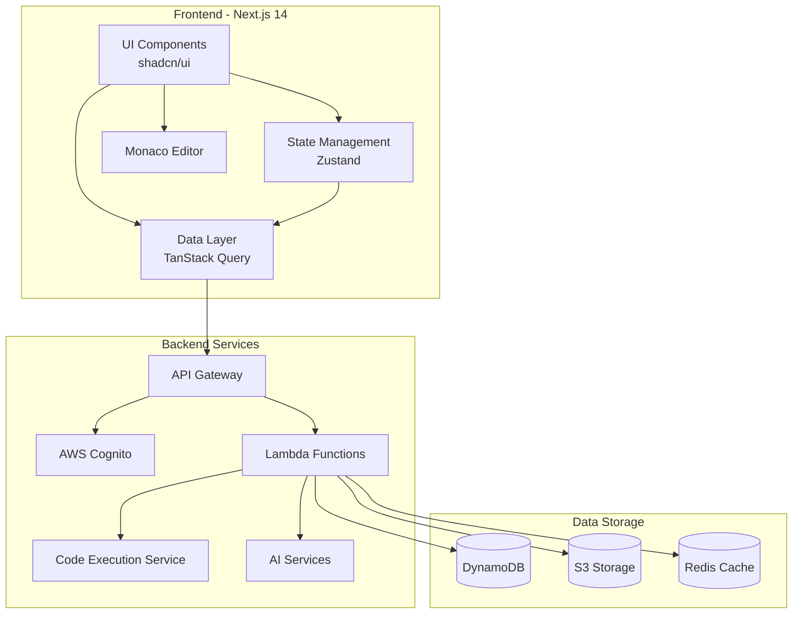
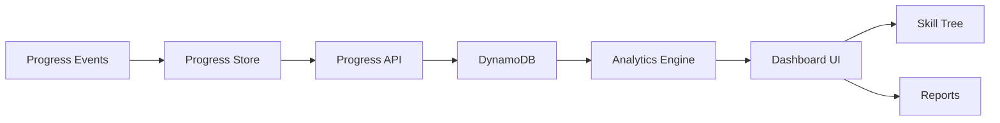
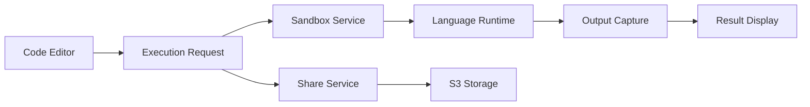
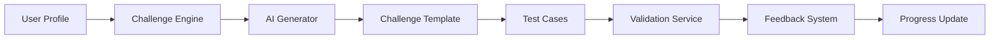

# Design Document: AstraMentor Enhanced Features

## Overview

This design document outlines the technical architecture and implementation approach for five major enhancements to the AstraMentor learning platform:

1. **Learning Progress Tracker**: A comprehensive system for tracking and visualizing learning progress, including skill trees, mastery levels, and time tracking
2. **Code Playground with Live Preview**: An in-browser code execution environment supporting JavaScript, Python, and TypeScript
3. **Smart Code Challenges**: An AI-powered system for generating adaptive coding exercises with automated testing
4. **AI Code Reviewer**: An automated code analysis tool providing quality, security, and performance feedback
5. **Code Snippet Library**: A personal knowledge management system for organizing and sharing reusable code

The design leverages the existing Next.js 14, TypeScript, and Tailwind CSS stack, integrating seamlessly with current authentication, state management, and UI patterns.

## Architecture

### High-Level Architecture



### Feature-Specific Architecture

#### 1. Learning Progress Tracker



#### 2. Code Playground



#### 3. Smart Code Challenges



## Components and Interfaces

### 1. Learning Progress Tracker Components

#### ProgressDashboard Component
```typescript
interface ProgressDashboard {
  userId: string;
  timeRange: 'week' | 'month' | 'all';
  onMilestoneClick: (milestone: Milestone) => void;
}

interface Milestone {
  id: string;
  title: string;
  description: string;
  completedAt: Date;
  category: string;
}
```

#### SkillTree Component
```typescript
interface SkillTreeNode {
  id: string;
  title: string;
  status: 'completed' | 'in-progress' | 'locked';
  prerequisites: string[];
  children: SkillTreeNode[];
  masteryLevel: number; // 0-100
}

interface SkillTree {
  userId: string;
  nodes: SkillTreeNode[];
  onNodeClick: (node: SkillTreeNode) => void;
}
```

#### Progress Store (Zustand)
```typescript
interface ProgressState {
  currentProgress: UserProgress;
  milestones: Milestone[];
  skillTree: SkillTreeNode[];
  timeTracking: TimeEntry[];
  masteryLevels: Map<string, number>;
  
  // Actions
  updateProgress: (activity: LearningActivity) => void;
  fetchProgress: (userId: string) => Promise<void>;
  generateReport: (timeRange: string) => ProgressReport;
}

interface UserProgress {
  userId: string;
  totalTimeSpent: number;
  completedTopics: string[];
  inProgressTopics: string[];
  achievements: Achievement[];
  lastUpdated: Date;
}
```

### 2. Code Playground Components

#### CodePlayground Component
```typescript
interface CodePlayground {
  initialCode?: string;
  language: 'javascript' | 'python' | 'typescript';
  onExecute: (code: string) => void;
  onShare: (code: string) => void;
  readOnly?: boolean;
}

interface ExecutionResult {
  output: string;
  error?: string;
  executionTime: number;
  memoryUsed: number;
}
```

#### Execution Service Interface
```typescript
interface ExecutionService {
  execute(request: ExecutionRequest): Promise<ExecutionResult>;
  terminate(executionId: string): Promise<void>;
}

interface ExecutionRequest {
  code: string;
  language: string;
  timeout: number; // milliseconds
  memoryLimit: number; // MB
}
```

#### Share Service Interface
```typescript
interface ShareService {
  createShare(code: string, language: string, metadata: ShareMetadata): Promise<ShareLink>;
  getSharedCode(shareId: string): Promise<SharedCode>;
  forkCode(shareId: string, userId: string): Promise<string>;
}

interface ShareLink {
  id: string;
  url: string;
  expiresAt: Date;
}

interface SharedCode {
  id: string;
  code: string;
  language: string;
  author: string;
  createdAt: Date;
  forkCount: number;
}
```

### 3. Smart Code Challenges Components

#### ChallengeView Component
```typescript
interface ChallengeView {
  challenge: Challenge;
  onSubmit: (solution: string) => void;
  onHint: () => void;
  onSkip: () => void;
}

interface Challenge {
  id: string;
  title: string;
  description: string;
  difficulty: 'beginner' | 'intermediate' | 'advanced';
  language: string;
  starterCode: string;
  testCases: TestCase[];
  hints: string[];
}

interface TestCase {
  id: string;
  input: any;
  expectedOutput: any;
  isHidden: boolean;
  description: string;
}
```

#### Challenge Engine Interface
```typescript
interface ChallengeEngine {
  generateChallenge(userId: string, topic: string): Promise<Challenge>;
  validateSolution(challengeId: string, solution: string): Promise<ValidationResult>;
  getHint(challengeId: string, attemptCount: number): Promise<string>;
  adjustDifficulty(userId: string, performance: PerformanceMetrics): void;
}

interface ValidationResult {
  passed: boolean;
  testResults: TestResult[];
  feedback: string;
  executionTime: number;
}

interface TestResult {
  testCaseId: string;
  passed: boolean;
  actualOutput: any;
  expectedOutput: any;
  error?: string;
}
```

#### Leaderboard Component
```typescript
interface Leaderboard {
  category: string;
  timeRange: 'daily' | 'weekly' | 'all-time';
  entries: LeaderboardEntry[];
}

interface LeaderboardEntry {
  rank: number;
  userId: string;
  username: string;
  score: number;
  challengesCompleted: number;
  averageTime: number;
}
```

### 4. AI Code Reviewer Components

#### CodeReviewPanel Component
```typescript
interface CodeReviewPanel {
  code: string;
  language: string;
  onReview: () => void;
  onApplySuggestion: (suggestion: Suggestion) => void;
}

interface ReviewResult {
  overallScore: number; // 0-100
  issues: CodeIssue[];
  suggestions: Suggestion[];
  metrics: CodeMetrics;
  analyzedAt: Date;
}

interface CodeIssue {
  id: string;
  severity: 'error' | 'warning' | 'info';
  category: 'quality' | 'security' | 'performance' | 'style';
  message: string;
  line: number;
  column: number;
  suggestion?: string;
}

interface Suggestion {
  id: string;
  description: string;
  before: string;
  after: string;
  impact: 'high' | 'medium' | 'low';
}

interface CodeMetrics {
  complexity: number;
  maintainability: number;
  testCoverage?: number;
  linesOfCode: number;
}
```

#### Code Review Service Interface
```typescript
interface CodeReviewService {
  analyzeCode(code: string, language: string): Promise<ReviewResult>;
  detectVulnerabilities(code: string, language: string): Promise<SecurityIssue[]>;
  suggestOptimizations(code: string, language: string): Promise<Optimization[]>;
  detectCodeSmells(code: string, language: string): Promise<CodeSmell[]>;
}

interface SecurityIssue extends CodeIssue {
  cveId?: string;
  severity: 'critical' | 'high' | 'medium' | 'low';
  remediation: string;
}

interface Optimization {
  description: string;
  estimatedImprovement: string;
  codeLocation: CodeLocation;
  example: string;
}

interface CodeSmell {
  type: string;
  description: string;
  location: CodeLocation;
  refactoringApproach: string;
}

interface CodeLocation {
  startLine: number;
  endLine: number;
  startColumn: number;
  endColumn: number;
}
```

### 5. Code Snippet Library Components

#### SnippetLibrary Component
```typescript
interface SnippetLibrary {
  snippets: Snippet[];
  onSearch: (query: string) => void;
  onFilter: (filters: SnippetFilters) => void;
  onSelect: (snippet: Snippet) => void;
  onDelete: (snippetId: string) => void;
}

interface Snippet {
  id: string;
  title: string;
  description: string;
  code: string;
  language: string;
  tags: string[];
  category: string;
  isPublic: boolean;
  author: string;
  createdAt: Date;
  updatedAt: Date;
  usageCount: number;
}

interface SnippetFilters {
  language?: string;
  category?: string;
  tags?: string[];
  isPublic?: boolean;
}
```

#### Snippet Service Interface
```typescript
interface SnippetService {
  createSnippet(snippet: CreateSnippetRequest): Promise<Snippet>;
  updateSnippet(id: string, updates: Partial<Snippet>): Promise<Snippet>;
  deleteSnippet(id: string): Promise<void>;
  searchSnippets(query: string, filters: SnippetFilters): Promise<Snippet[]>;
  exportSnippets(snippetIds: string[]): Promise<string>; // JSON
  importSnippets(jsonData: string): Promise<Snippet[]>;
  shareSnippet(id: string): Promise<ShareLink>;
}

interface CreateSnippetRequest {
  title: string;
  description: string;
  code: string;
  language: string;
  tags: string[];
  category: string;
  isPublic: boolean;
}
```

## Data Models

### Progress Data Model

```typescript
// DynamoDB Table: UserProgress
interface UserProgressRecord {
  PK: string; // USER#${userId}
  SK: string; // PROGRESS#${date}
  userId: string;
  date: string; // ISO date
  activitiesCompleted: LearningActivity[];
  timeSpent: number; // minutes
  topicsStudied: string[];
  masteryUpdates: MasteryUpdate[];
  createdAt: string;
  updatedAt: string;
}

interface LearningActivity {
  type: 'challenge' | 'playground' | 'review' | 'snippet';
  id: string;
  duration: number;
  completed: boolean;
  score?: number;
}

interface MasteryUpdate {
  language: string;
  previousLevel: number;
  newLevel: number;
  reason: string;
}

// DynamoDB Table: SkillTree
interface SkillTreeRecord {
  PK: string; // USER#${userId}
  SK: string; // SKILL#${skillId}
  userId: string;
  skillId: string;
  status: 'completed' | 'in-progress' | 'locked';
  progress: number; // 0-100
  startedAt?: string;
  completedAt?: string;
  timeSpent: number;
}

// DynamoDB Table: Achievements
interface AchievementRecord {
  PK: string; // USER#${userId}
  SK: string; // ACHIEVEMENT#${achievementId}
  userId: string;
  achievementId: string;
  title: string;
  description: string;
  earnedAt: string;
  category: string;
}
```

### Code Playground Data Model

```typescript
// DynamoDB Table: SharedCode
interface SharedCodeRecord {
  PK: string; // SHARE#${shareId}
  SK: string; // METADATA
  shareId: string;
  code: string;
  language: string;
  authorId: string;
  authorName: string;
  title?: string;
  description?: string;
  createdAt: string;
  expiresAt: string;
  forkCount: number;
  viewCount: number;
  isPublic: boolean;
}

// DynamoDB Table: PlaygroundSessions
interface PlaygroundSessionRecord {
  PK: string; // USER#${userId}
  SK: string; // SESSION#${sessionId}
  userId: string;
  sessionId: string;
  code: string;
  language: string;
  lastSaved: string;
  autoSaveEnabled: boolean;
}
```

### Challenge Data Model

```typescript
// DynamoDB Table: Challenges
interface ChallengeRecord {
  PK: string; // CHALLENGE#${challengeId}
  SK: string; // METADATA
  challengeId: string;
  title: string;
  description: string;
  difficulty: string;
  language: string;
  topic: string;
  starterCode: string;
  solution: string;
  testCases: TestCase[];
  hints: string[];
  createdAt: string;
  createdBy: 'ai' | 'manual';
}

// DynamoDB Table: ChallengeAttempts
interface ChallengeAttemptRecord {
  PK: string; // USER#${userId}
  SK: string; // ATTEMPT#${challengeId}#${timestamp}
  userId: string;
  challengeId: string;
  solution: string;
  passed: boolean;
  testResults: TestResult[];
  attemptNumber: number;
  hintsUsed: number;
  timeSpent: number;
  submittedAt: string;
}

// DynamoDB Table: Leaderboard
interface LeaderboardRecord {
  PK: string; // LEADERBOARD#${category}#${timeRange}
  SK: string; // SCORE#${score}#${userId}
  category: string;
  timeRange: string;
  userId: string;
  username: string;
  score: number;
  challengesCompleted: number;
  averageTime: number;
  lastUpdated: string;
}
```

### Code Review Data Model

```typescript
// DynamoDB Table: CodeReviews
interface CodeReviewRecord {
  PK: string; // USER#${userId}
  SK: string; // REVIEW#${reviewId}
  reviewId: string;
  userId: string;
  code: string;
  language: string;
  overallScore: number;
  issues: CodeIssue[];
  suggestions: Suggestion[];
  metrics: CodeMetrics;
  reviewedAt: string;
}
```

### Snippet Library Data Model

```typescript
// DynamoDB Table: Snippets
interface SnippetRecord {
  PK: string; // USER#${userId}
  SK: string; // SNIPPET#${snippetId}
  snippetId: string;
  userId: string;
  title: string;
  description: string;
  code: string;
  language: string;
  tags: string[];
  category: string;
  isPublic: boolean;
  createdAt: string;
  updatedAt: string;
  usageCount: number;
}

// DynamoDB GSI: PublicSnippets
// PK: PUBLIC#${language}, SK: SNIPPET#${snippetId}

// DynamoDB GSI: SnippetsByTag
// PK: TAG#${tag}, SK: SNIPPET#${snippetId}
```


## Correctness Properties

*A property is a characteristic or behavior that should hold true across all valid executions of a system—essentially, a formal statement about what the system should do. Properties serve as the bridge between human-readable specifications and machine-verifiable correctness guarantees.*

### Progress Tracker Properties

**Property 1: Progress update immediacy**
*For any* learning activity completion event, updating the progress tracker should immediately reflect the completion in the user's progress data when queried.
**Validates: Requirements 1.1**

**Property 2: Dashboard data completeness**
*For any* user with progress data, the dashboard should display all milestones and achievements present in the user's progress record.
**Validates: Requirements 1.2**

**Property 3: Skill tree status accuracy**
*For any* skill tree state, the rendered tree should correctly mark each node with its actual status (completed, in-progress, or locked) based on the underlying data.
**Validates: Requirements 1.3**

**Property 4: Time tracking display accuracy**
*For any* set of time entries, the displayed time spent on each concept should match the sum of all time entries for that concept.
**Validates: Requirements 1.4**

**Property 5: Mastery level calculation consistency**
*For any* user's learning history in a programming language, the calculated mastery level should be deterministic and increase monotonically with additional learning activities.
**Validates: Requirements 1.5**

**Property 6: Report generation completeness**
*For any* time range (weekly or monthly), the generated progress report should include all learning activities that occurred within that time range.
**Validates: Requirements 1.6**

**Property 7: Data persistence round-trip**
*For any* progress update or snippet modification, persisting the data and then immediately querying it back should return equivalent data.
**Validates: Requirements 1.7, 12.2**

### Code Playground Properties

**Property 8: Multi-language execution support**
*For any* valid code snippet in JavaScript, Python, or TypeScript, the execution service should successfully execute it and return a result.
**Validates: Requirements 2.1**

**Property 9: Output capture completeness**
*For any* code that produces output (return values or console logs), the execution result should capture and display all output in the order it was generated.
**Validates: Requirements 2.2, 2.3**

**Property 10: Error reporting with location**
*For any* code that throws an error during execution, the error message should include the line number where the error occurred.
**Validates: Requirements 2.6**

**Property 11: Session state persistence**
*For any* code changes made during a session, the code should remain unchanged when the session is resumed (before any new edits).
**Validates: Requirements 2.8**

### Code Sharing Properties

**Property 12: Share URL uniqueness**
*For any* two different code sharing requests, the generated URLs should be unique (no collisions).
**Validates: Requirements 3.1**

**Property 13: Share round-trip consistency**
*For any* code snippet that is shared, loading the code from the share URL should return code identical to the original.
**Validates: Requirements 3.2**

**Property 14: Fork independence**
*For any* shared code that is forked, modifications to the forked copy should not affect the original shared code.
**Validates: Requirements 3.4**

**Property 15: Share metadata completeness**
*For any* shared snippet, the displayed metadata should include the original author and creation date.
**Validates: Requirements 3.6**

### Challenge System Properties

**Property 16: Challenge difficulty matching**
*For any* user skill level, generated challenges should have difficulty ratings that fall within an appropriate range for that skill level.
**Validates: Requirements 4.1**

**Property 17: Adaptive difficulty adjustment**
*For any* user with a performance history showing consistent success, the next generated challenge should have equal or higher difficulty than previous challenges.
**Validates: Requirements 4.2**

**Property 18: Test case execution completeness**
*For any* challenge solution submission, the validation should execute all test cases defined for that challenge and report results for each.
**Validates: Requirements 4.3**

**Property 19: Feedback provision**
*For any* challenge solution submission, the validation result should include feedback indicating correctness and which test cases passed or failed.
**Validates: Requirements 4.4**

**Property 20: Hint progression safety**
*For any* challenge, the sequence of hints should progressively reveal information without any single hint containing the complete solution.
**Validates: Requirements 4.5**

**Property 21: Test case minimum count**
*For any* generated challenge, it should include at least 5 test cases.
**Validates: Requirements 4.6**

**Property 22: Challenge tracking accuracy**
*For any* completed challenge, the user's challenge history should be updated to reflect the completion and the success/failure outcome.
**Validates: Requirements 4.7**

### Gamification Properties

**Property 23: Achievement awarding**
*For any* user who reaches a challenge completion milestone, the appropriate achievement should be awarded and appear in their achievement list.
**Validates: Requirements 5.1**

**Property 24: Leaderboard consistency**
*For any* challenge completion, the leaderboard should be updated immediately and the user's rank should accurately reflect their score relative to other users.
**Validates: Requirements 5.2, 5.3**

**Property 25: Achievement badge display**
*For any* earned achievement, the corresponding badge should be visible on the user's profile.
**Validates: Requirements 5.4**

**Property 26: Ranking calculation correctness**
*For any* set of challenge completions, users with higher difficulty challenges or faster completion times should rank higher than those with easier or slower completions.
**Validates: Requirements 5.5**

### Code Review Properties

**Property 27: Quality issue detection**
*For any* code containing known quality issues (e.g., unused variables, complex functions), the code reviewer should detect and report at least those issues.
**Validates: Requirements 6.1**

**Property 28: Violation location specificity**
*For any* detected best practice violation, the report should include the specific line number where the violation occurs.
**Validates: Requirements 6.2**

**Property 29: Security vulnerability detection**
*For any* code containing common security vulnerabilities (e.g., SQL injection, XSS), the code reviewer should detect and report those vulnerabilities with remediation suggestions.
**Validates: Requirements 6.3**

**Property 30: Optimization identification**
*For any* code with obvious performance issues (e.g., nested loops, inefficient algorithms), the code reviewer should identify optimization opportunities.
**Validates: Requirements 6.4**

**Property 31: Code smell detection**
*For any* code exhibiting common code smells (e.g., long methods, duplicate code), the code reviewer should detect and suggest refactoring approaches.
**Validates: Requirements 6.5**

**Property 32: Quality score provision**
*For any* code review request, the result should include a numeric quality score between 0 and 100.
**Validates: Requirements 6.6**

**Property 33: Multi-language review support**
*For any* valid code in JavaScript, TypeScript, or Python, the code reviewer should successfully analyze it and return a review result.
**Validates: Requirements 6.8**

### Snippet Library Properties

**Property 34: Snippet metadata completeness**
*For any* saved snippet, querying it back should return all metadata fields (title, description, language, tags) with their original values.
**Validates: Requirements 7.1**

**Property 35: Snippet organization by category**
*For any* snippet with a specific language or category, filtering by that language or category should include that snippet in the results.
**Validates: Requirements 7.2**

**Property 36: Search field coverage**
*For any* snippet, searching for text that appears in its title, description, or code should return that snippet in the results.
**Validates: Requirements 7.3**

**Property 37: Search relevance ranking**
*For any* search query, results where the query appears in the title should rank higher than results where it only appears in the description or code.
**Validates: Requirements 7.4**

**Property 38: Snippet sharing accessibility**
*For any* snippet marked as public, it should be accessible to other users through community search or direct link.
**Validates: Requirements 7.5**

**Property 39: Export-import round-trip**
*For any* set of snippets, exporting them to JSON and then importing that JSON should result in equivalent snippets with all data preserved.
**Validates: Requirements 7.6, 7.7**

**Property 40: Snippet deletion completeness**
*For any* deleted snippet, subsequent queries for that snippet should return not-found, and it should not appear in any search results.
**Validates: Requirements 7.8**

### Authentication and Authorization Properties

**Property 41: Authentication verification**
*For any* request to a protected feature, the system should verify authentication status before processing the request.
**Validates: Requirements 8.2**

**Property 42: Data access isolation**
*For any* user, queries for progress data, snippets, or challenge history should only return data belonging to that user, never data from other users.
**Validates: Requirements 8.3**

**Property 43: Session expiration handling**
*For any* expired authentication session, attempts to access protected features should result in a re-authentication prompt.
**Validates: Requirements 8.4**

### UI and State Management Properties

**Property 44: Theme support consistency**
*For any* new component, it should render correctly in both dark and light theme modes without visual artifacts.
**Validates: Requirements 9.3**

**Property 45: Keyboard shortcut functionality**
*For any* defined keyboard shortcut, triggering it should execute the associated action.
**Validates: Requirements 9.4**

**Property 46: Optimistic update behavior**
*For any* data mutation, the UI should update immediately with the expected result before server confirmation.
**Validates: Requirements 10.3**

**Property 47: Loading state consistency**
*For any* data fetching operation, a loading indicator should be displayed until the data is loaded or an error occurs.
**Validates: Requirements 10.4**

**Property 48: Error handling completeness**
*For any* error during data fetching or mutation, the UI should display a user-friendly error message and provide a retry option.
**Validates: Requirements 10.5**

**Property 49: Cache invalidation correctness**
*For any* data mutation, the cache for affected queries should be invalidated, causing subsequent queries to fetch fresh data.
**Validates: Requirements 10.6**

### Performance Properties

**Property 50: Virtual scrolling activation**
*For any* list with more than 100 items, only the visible items plus a buffer should be rendered in the DOM.
**Validates: Requirements 11.5**

### Data Synchronization Properties

**Property 51: Auto-save timing**
*For any* code changes in the playground, if no further changes are made, an auto-save should occur within 30 seconds.
**Validates: Requirements 12.1**

**Property 52: Cross-device synchronization**
*For any* progress update on one device, querying progress from another device for the same user should reflect that update within a reasonable sync interval.
**Validates: Requirements 12.3**

**Property 53: Offline queue persistence**
*For any* changes made while offline, those changes should be queued and successfully applied when connectivity is restored.
**Validates: Requirements 12.4**

**Property 54: Sync status visibility**
*For any* synchronization operation (in-progress, completed, or failed), the sync status should be visible to the user.
**Validates: Requirements 12.5**

**Property 55: Conflict resolution consistency**
*For any* conflicting updates to the same data, the system should apply the last-write-wins strategy and notify the user of the conflict.
**Validates: Requirements 12.6**

## Error Handling

### Error Categories

1. **Execution Errors**: Code execution failures, timeouts, memory limits
2. **Validation Errors**: Invalid input, failed test cases, malformed data
3. **Network Errors**: Connection failures, timeouts, service unavailability
4. **Authentication Errors**: Expired sessions, invalid tokens, unauthorized access
5. **Data Errors**: Not found, conflicts, constraint violations

### Error Handling Strategies

#### Code Execution Errors

```typescript
interface ExecutionError {
  type: 'timeout' | 'runtime_error' | 'memory_limit' | 'syntax_error';
  message: string;
  line?: number;
  column?: number;
  stack?: string;
}

// Strategy: Catch all execution errors, sanitize stack traces, provide helpful messages
try {
  const result = await executeCode(code, language);
  return result;
} catch (error) {
  if (error instanceof TimeoutError) {
    return {
      error: {
        type: 'timeout',
        message: 'Code execution exceeded 5 second limit. Consider optimizing your code or reducing input size.'
      }
    };
  }
  // Handle other error types...
}
```

#### Network and API Errors

```typescript
// Strategy: Implement exponential backoff retry with user feedback
const fetchWithRetry = async (url: string, options: RequestInit, maxRetries = 3) => {
  for (let i = 0; i < maxRetries; i++) {
    try {
      const response = await fetch(url, options);
      if (!response.ok) {
        throw new APIError(response.status, await response.text());
      }
      return response;
    } catch (error) {
      if (i === maxRetries - 1) throw error;
      await delay(Math.pow(2, i) * 1000); // Exponential backoff
    }
  }
};
```

#### Authentication Errors

```typescript
// Strategy: Redirect to login on auth failure, preserve intended destination
const handleAuthError = (error: AuthError, intendedPath: string) => {
  if (error.type === 'expired_token') {
    // Store intended destination
    sessionStorage.setItem('redirect_after_login', intendedPath);
    // Redirect to login
    router.push('/login');
  } else if (error.type === 'unauthorized') {
    toast.error('You do not have permission to access this resource');
  }
};
```

#### Data Validation Errors

```typescript
// Strategy: Provide specific field-level errors with suggestions
interface ValidationError {
  field: string;
  message: string;
  suggestion?: string;
}

const validateSnippet = (snippet: CreateSnippetRequest): ValidationError[] => {
  const errors: ValidationError[] = [];
  
  if (!snippet.title || snippet.title.trim().length === 0) {
    errors.push({
      field: 'title',
      message: 'Title is required',
      suggestion: 'Provide a descriptive title for your snippet'
    });
  }
  
  if (snippet.code.length > 10000) {
    errors.push({
      field: 'code',
      message: 'Code exceeds maximum length of 10,000 characters',
      suggestion: 'Consider breaking this into multiple smaller snippets'
    });
  }
  
  return errors;
};
```

#### Conflict Resolution

```typescript
// Strategy: Last-write-wins with user notification
const handleConflict = async (localData: any, remoteData: any) => {
  // Compare timestamps
  if (localData.updatedAt > remoteData.updatedAt) {
    // Local is newer, push to server
    await syncToServer(localData);
    toast.info('Your local changes were synced to the server');
  } else {
    // Remote is newer, notify user
    toast.warning('Newer data found on server. Your local changes were overwritten.', {
      action: {
        label: 'View Changes',
        onClick: () => showDiffModal(localData, remoteData)
      }
    });
    // Update local with remote
    updateLocal(remoteData);
  }
};
```

### Error Recovery Mechanisms

1. **Automatic Retry**: Network requests retry with exponential backoff
2. **Offline Queue**: Changes queued when offline, synced when online
3. **Graceful Degradation**: Features degrade gracefully when services unavailable
4. **User Feedback**: Clear error messages with actionable next steps
5. **Error Boundaries**: React error boundaries prevent full app crashes
6. **Logging**: All errors logged for debugging and monitoring

## Testing Strategy

### Dual Testing Approach

This feature requires both unit testing and property-based testing for comprehensive coverage:

- **Unit tests**: Verify specific examples, edge cases, error conditions, and integration points
- **Property tests**: Verify universal properties across all inputs through randomization

Both approaches are complementary and necessary. Unit tests catch concrete bugs and validate specific scenarios, while property tests verify general correctness across a wide input space.

### Property-Based Testing Configuration

**Library Selection**: 
- **JavaScript/TypeScript**: Use `fast-check` library
- **Python**: Use `hypothesis` library (if backend services are implemented in Python)

**Test Configuration**:
- Minimum 100 iterations per property test (due to randomization)
- Each property test must reference its design document property
- Tag format: `Feature: astramentor-enhanced-features, Property {number}: {property_text}`

**Example Property Test Structure**:

```typescript
import fc from 'fast-check';

describe('Progress Tracker Properties', () => {
  // Feature: astramentor-enhanced-features, Property 1: Progress update immediacy
  it('should immediately reflect completed activities in progress data', () => {
    fc.assert(
      fc.property(
        fc.record({
          userId: fc.uuid(),
          activity: fc.record({
            type: fc.constantFrom('challenge', 'playground', 'review', 'snippet'),
            id: fc.uuid(),
            duration: fc.integer({ min: 1, max: 300 }),
            completed: fc.constant(true),
            score: fc.option(fc.integer({ min: 0, max: 100 }))
          })
        }),
        async ({ userId, activity }) => {
          // Arrange
          const tracker = new ProgressTracker();
          
          // Act
          await tracker.updateProgress(userId, activity);
          const progress = await tracker.getProgress(userId);
          
          // Assert
          expect(progress.activitiesCompleted).toContainEqual(
            expect.objectContaining({
              type: activity.type,
              id: activity.id,
              completed: true
            })
          );
        }
      ),
      { numRuns: 100 }
    );
  });
});
```

### Unit Testing Strategy

**Focus Areas for Unit Tests**:
1. Specific examples demonstrating correct behavior
2. Edge cases (empty inputs, boundary values, special characters)
3. Error conditions (invalid inputs, network failures, timeouts)
4. Integration points between components
5. UI component rendering with specific props

**Example Unit Test Structure**:

```typescript
describe('CodePlayground', () => {
  it('should display timeout message for long-running code', async () => {
    const longRunningCode = 'while(true) {}';
    const playground = render(<CodePlayground language="javascript" />);
    
    await playground.executeCode(longRunningCode);
    
    expect(playground.getByText(/execution exceeded 5 second limit/i)).toBeInTheDocument();
  });
  
  it('should handle empty code gracefully', async () => {
    const playground = render(<CodePlayground language="javascript" />);
    
    await playground.executeCode('');
    
    expect(playground.getByText(/no code to execute/i)).toBeInTheDocument();
  });
});
```

### Integration Testing

**Key Integration Points**:
1. Monaco Editor integration with Code Playground
2. Authentication flow with protected features
3. State management (Zustand) with UI components
4. TanStack Query with API endpoints
5. Real-time updates and WebSocket connections

### Test Coverage Goals

- **Unit Test Coverage**: Minimum 80% code coverage
- **Property Test Coverage**: All 55 correctness properties implemented
- **Integration Test Coverage**: All critical user flows
- **E2E Test Coverage**: Core user journeys (signup → challenge → review → snippet)

### Testing Tools and Libraries

- **Unit Testing**: Jest, React Testing Library
- **Property Testing**: fast-check
- **Integration Testing**: Jest with MSW (Mock Service Worker)
- **E2E Testing**: Playwright or Cypress
- **Accessibility Testing**: jest-axe, pa11y
- **Visual Regression**: Chromatic or Percy

### Continuous Testing

- Run unit and property tests on every commit
- Run integration tests on pull requests
- Run E2E tests on staging deployments
- Monitor test execution time and optimize slow tests
- Track test coverage trends over time
